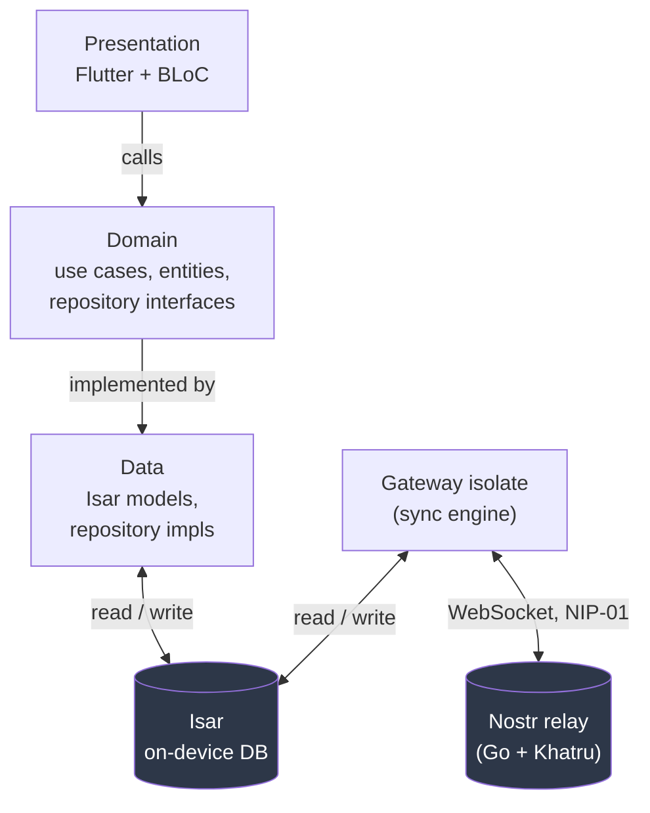
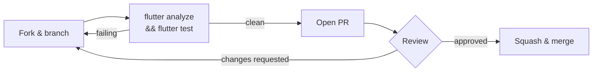

# Contributing to UNIUN

Thanks for your interest in UNIUN — a decentralized, offline-first social and
knowledge network built on Nostr. This guide covers everything you need to
set up the project, understand its architecture, and get a pull request
merged.

By participating, you agree to follow the [Code of Conduct](CODE_OF_CONDUCT.md).

## Table of contents

- [Ways to contribute](#ways-to-contribute)
- [Project setup](#project-setup)
- [Architecture at a glance](#architecture-at-a-glance)
- [Core rules (read before writing code)](#core-rules-read-before-writing-code)
- [Testing](#testing)
- [Commit and branch conventions](#commit-and-branch-conventions)
- [Submitting a pull request](#submitting-a-pull-request)
- [Reporting bugs](#reporting-bugs)
- [Reporting security issues](#reporting-security-issues)
- [Getting help](#getting-help)

## Ways to contribute

You don't need to write Dart to help:

| Contribution | Where to start |
|---|---|
| Bug reports | [Reporting bugs](#reporting-bugs) |
| Bug fixes / features | Fork, branch, open a PR — see below |
| Tests | `test/TESTING.md` is the single source of truth for test style |
| Docs | `docs/` — architecture notes, NIPs implemented, messaging design |
| Relay (Go) | `uniun-backend/` — a separate Go module, see `uniun-backend/DEPLOY.md` |

If you're picking up a bug or feature, comment on the issue first (or open
one) so two people don't end up solving the same thing.

## Project setup

**Requirements:** Flutter (Dart SDK `>=3.12.0 <4.0.0`), and Go 1.21+ only if
you're touching `uniun-backend/`.

```bash
git clone https://github.com/<your-fork>/uniun.git
cd uniun
flutter pub get

# Generate Isar / Freezed / Injectable code — required after clone and
# after touching any @freezed, @Collection, or @injectable class.
flutter pub run build_runner build --delete-conflicting-outputs

# Run the app
flutter run

# Run the relay locally (optional — the app works fully offline without it)
cd uniun-backend && docker compose up
```

## Architecture at a glance

UNIUN is Clean Architecture end to end: the UI only ever reads from the local
Isar database, and a background Gateway isolate is the *only* thing that
talks to Nostr relays.



The dependency rule is one-directional: **Presentation → Domain ← Data**.
Domain never imports Isar or Flutter. Full detail, including the Gateway's
inbound/outbound pipeline, retention policy, and every Nostr kind UNIUN
uses, lives in `CLAUDE.md` at the repo root — read it before your first PR,
it is the canonical architecture reference for this codebase.

## Core rules (read before writing code)

These are non-negotiable product/architecture decisions, not style
preferences — PRs that violate them will be asked to change regardless of
how clean the code otherwise is:

- **Feed Freedom.** No delete, no soft-delete, no NIP-09. Never add a
  `deleted`/`isDeleted` field anywhere.
- **Everything is a Note.** No `Post`, `Comment`, `Thread`, or other
  Reddit-shaped model. Every user-created message is a Kind-1/14/42/9023
  Nostr event stored in the one unified `Note` collection.
- **`isar_community`, never `isar`.** The original package doesn't support
  current Dart.
- **Freezed 3.x `abstract class` pattern** for every domain entity — not the
  2.x `class` pattern.
- **The Flutter app never talks to a relay directly.** All network sync goes
  through `lib/gateway/`.

`CLAUDE.md` has the full list, plus the reasoning behind each one.

## Testing

`test/TESTING.md` is the canonical guide — read it before writing or
modifying a single test. In short:

- One factual docstring per test file (`/// Covers: X, Y, Z.`) — no prose.
- Use the factories in `test/_helpers/fixtures.dart`; never hand-roll an
  entity in a new test.
- `bloc_test` + `mocktail` for BLoCs/cubits; real `openTestIsar()` for
  anything Isar-backed. No `mockito`.
- Edge cases (Unicode, RTL, boundary values, malformed input, concurrency)
  belong in the same test file as the happy path, not a separate
  `*_edge_cases_test.dart`.

```bash
flutter analyze
flutter test test/
```

Both must be clean before you open a PR. A PR that adds behavior without a
test for it will be asked to add one.

## Commit and branch conventions

Commit messages follow `type: short summary`, imperative mood, lowercase
type:

```
feat: add relay health indicator to settings
fix: correct thread reply ordering for deleted parents
docs: contributing guide
test: cover the domain/usecases layer
refactor: extract note tag-order builder
```

Keep the summary line under ~70 characters; put the "why" in the body if it
isn't obvious from the diff. Squash fixup commits before requesting review.

## Submitting a pull request



1. Branch off `main`.
2. Keep the PR focused — one bug or feature per PR. Large changes are easier
   to review (and land) split into smaller, sequential PRs.
3. Fill in what changed and why; link the issue it closes if there is one.
4. Make sure CI (analyze + full test suite) is green before requesting
   review.
5. Respond to review comments with new commits, not force-pushes, until the
   PR is approved — it keeps the review thread readable.

## Reporting bugs

Open a [GitHub issue](../../issues/new) with:

- What you expected vs. what happened.
- Steps to reproduce (a minimal one is worth more than a long one).
- Platform (Android/iOS version) and whether it reproduces with a fresh
  install.
- Logs if the app crashed — `flutter logs` output is usually enough.

## Reporting security issues

**Do not open a public issue for a security vulnerability.** Use GitHub's
[private security advisory](../../security/advisories/new) form instead, so
the report isn't visible before a fix ships.

## Getting help

- Architecture questions → `CLAUDE.md` and `docs/`.
- Stuck on a test → `test/TESTING.md`.
- Anything else → open a [discussion](../../discussions) or a draft PR and
  ask inline.
