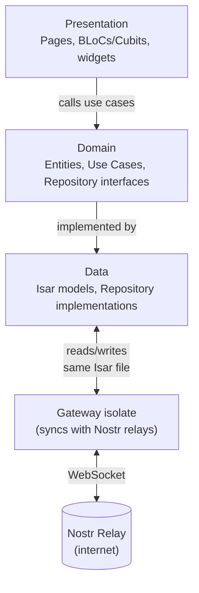
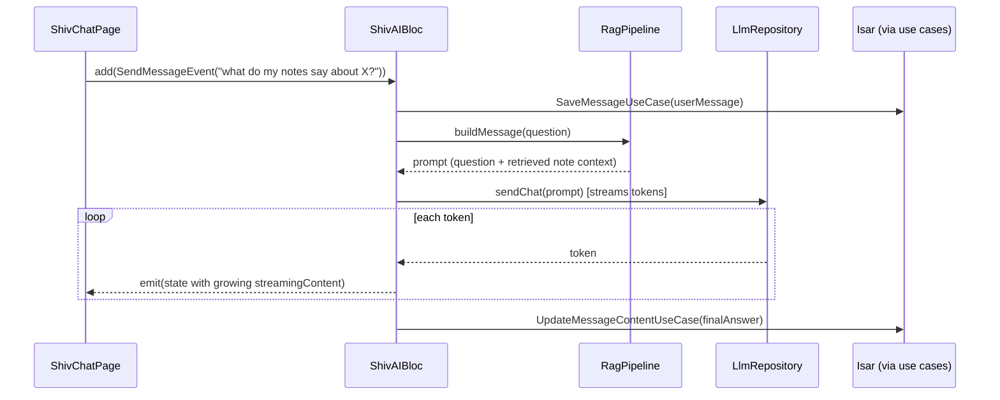

# UNIUN Codebase Guide — Layers, Data Flow, and Folder Structure

## The simple version

UNIUN is built in three layers, and data only ever flows one direction through them: what you tap on screen calls a use case, the use case asks a repository, the repository reads or writes Isar (the on-device database — see `ISAR_DB.md`). Nothing skips a layer, and nothing flows backwards.



The Gateway isolate is its own box on purpose — it's a separate Dart isolate (a second thread, effectively) that owns every relay WebSocket connection. The UI never talks to a relay directly; it only ever reads Isar, and the Gateway is the only thing that writes what it downloads into Isar. See `ISAR_DB.md` for exactly how two isolates safely share one database file.

**Rules that never break:**
- Presentation never imports Isar — only calls use cases.
- Domain never imports Flutter or Isar — it's pure Dart, testable without either.
- Data-layer methods return `Either<Failure, T>` (from the `dartz` package) — never a raw thrown exception the caller has to guess about.

## Each layer, in brief — full depth lives in its own doc

Each layer now has a dedicated, example-verified doc — this file stays the "big picture" overview so those three don't have to repeat each other:

- **Data layer** (`lib/data/`) — Isar `@Collection` models + repository implementations + data sources, `Either<Failure, T>` error handling, `writeTxn` rules. Full depth: `docs/Architecture/DATA_LAYER.md`.
- **Domain layer** (`lib/domain/`) — freezed entities, abstract repository interfaces, use cases, Input classes. Zero Isar/Flutter imports — this is the part of the app that could run as plain Dart with no device at all. Full depth: `docs/Architecture/DOMAIN_LAYER.md`.
- **Presentation layer** (`lib/features/*/bloc/` or `.../cubit/`) — BLoCs and Cubits, which one to reach for and why, `bloc_concurrency` transformers, how state gets to a widget. Full depth: `docs/Architecture/PRESENTATION_LAYER.md`.

## A concrete trip through all three layers — sending a Shiv chat message



`LlmRepository` is the one interesting fork in this flow: depending on which backend the user picked (on-device Gemma model, or UNIUN Cloud), it dispatches to a different data source underneath — the BLoC and the use case above it never know or care which one is active. See `docs/SHIVA/SHIV_AI.md` for that split.

## Folder structure — what's actually where today

```
lib/
├── main.dart
├── common/                # get_it locator, snackbar, shared widgets used by 2+ features
├── core/
│   ├── enum/              # NoteType, MessageRole, RelayStatus, ...
│   ├── error/             # Failure freezed union
│   ├── router/            # AppRoutes + GoRouter setup + deep links
│   ├── scan/               # shared QR card/payload/scanner widgets (not feature-specific)
│   ├── theme/              # AppColors, AppTextStyles, light + dark ColorSchemes
│   └── usecases/          # UseCase<T,P> / NoParamsUseCase<T> base classes
├── data/
│   ├── datasources/
│   │   ├── isar_module.dart      # the one place Isar.open() happens for the main isolate
│   │   ├── isar_schemas.dart     # every collection's schema, registered here
│   │   ├── cloud/                # UniunGatewayClient (UNIUN Cloud HTTP client)
│   │   └── llm/                  # local model runner, inference scheduler, LLM data sources
│   ├── models/                   # Isar @Collection models (mutable)
│   └── repositories/             # Repository implementations (@Injectable)
├── domain/
│   ├── entities/                 # @freezed abstract class entities
│   ├── repositories/             # Abstract interfaces
│   └── usecases/                 # Business logic, grouped by feature
├── gateway/                       # Relay sync isolate — owned and editable by this codebase
│   ├── orchestrator/              # coordinates relay connections + resubscribes
│   ├── transport/                 # the actual WebSocket connections
│   ├── session/                   # per-relay session state
│   ├── inbound/                   # incoming-event handlers → write to Isar
│   ├── outbound/                  # the publish queue pump
│   ├── watchers/                  # Isar watchLazy() hub → triggers resubscribes
│   └── cleanup/                   # retention policy enforcement
├── l10n/                          # generated — every UI string goes through AppLocalizations
└── features/                      # every feature module lives here
    ├── onboarding/, home/, vishnu/, brahma/, shiv/, thread/,
    ├── channels/, private_channels/, dm/, followed_notes/,
    ├── saved_notes/, share/, settings/, mesh/, surrounding/, ...
```

The Gateway (`lib/gateway/`) is **not** third-party or off-limits code — it's owned and actively edited as part of this codebase, just kept in its own folder because it's the one place allowed to open relay WebSocket connections. (An earlier version of this doc described a monolithic `EmbeddedServer`/`CentralRelayManager` design — that's been refactored away into the `orchestrator/`+`transport/`+`session/`+`watchers/` split shown above; if you see either of those old names referenced anywhere, it's stale.)

## Key patterns, quickly

Freezed entities, `Either`-based error handling, and the BLoC/Cubit state pattern are covered with real examples in `DATA_LAYER.md`, `DOMAIN_LAYER.md`, and `PRESENTATION_LAYER.md` respectively. Two cross-cutting patterns that don't belong to any single layer:

**Dependency injection** via `injectable`/`get_it`:
```dart
@singleton      // the Isar instance — exactly one for the app's lifetime
@injectable     // BLoCs, repository implementations
@lazySingleton  // use cases — built on first use, then reused
```

**Localization** — no hardcoded UI strings, ever:
```dart
final l10n = AppLocalizations.of(context)!;
Text(l10n.shivName)
```
Add the key to `lib/l10n/app_en.arb`, run `flutter gen-l10n`, use `l10n.yourKey`.

## What's built

Every module named in the folder tree above — Vishnu feed, Brahma create/graph, Shiv AI (model select, RAG/GraphRAG, branch tree, streaming, Ganas, Nataraj), public + private channels, **DMs (NIP-17, fully shipped — three-layer gift wrap, not a pending schema)**, saved/followed notes, sharing, settings, mesh/offline sync, and Surrounding — is implemented and in active use. There is no "schema exists, UI pending" module left; treat any doc that claims otherwise as stale (this one used to, until this rewrite).

## Where to look next

- `DATA_LAYER.md` — repositories, data sources, Isar models, error handling.
- `DOMAIN_LAYER.md` — entities, use cases, repository interfaces, Input classes.
- `PRESENTATION_LAYER.md` — BLoC vs Cubit, transformers, how state reaches a widget.
- `ISAR_DB.md` — the database all three layers ultimately sit on top of.
- `CLAUDE.md` — the terse, rule-by-rule reference (naming conventions, exact do/don't lists) for anyone actively writing code here.
- `docs/UNIUN.md` — the simple, feature-by-feature tour of what the app actually does.
