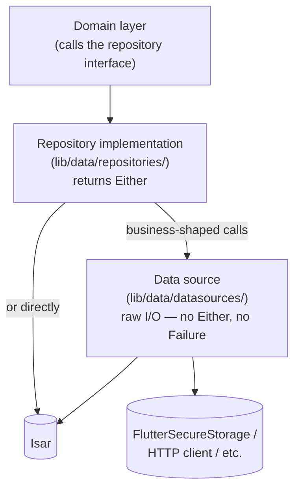

# The Data Layer — Complete Guide

`lib/data/`

## The simple version

The data layer is where the domain layer's abstract promises ("there is a way to follow a user") become concrete mechanics ("open an Isar transaction, put this row, republish the Kind-3 contact list"). It's split into two kinds of classes with a deliberate division of labor:



**Data sources are raw I/O wrappers.** They read/write a database, secure storage, or an HTTP endpoint and hand back plain values or throw — no `Either`, no `Failure`. **Repository implementations are the business-shaped boundary** — they compose one or more data sources (or talk to Isar directly), catch whatever goes wrong, and translate it into `Either<Failure, T>` for the domain layer to consume. This is a real, verified split — not every repository needs a separate data source (many just hold an `Isar` field directly), but whenever there IS a data source, the repository is what wraps its raw results.

## Repository implementations — the concrete pattern

```dart
// lib/data/repositories/followed_user_repository_impl.dart — the real shape
@Injectable(as: FollowedUserRepository)
class FollowedUserRepositoryImpl extends FollowedUserRepository {
  final Isar _isar;
  final EventQueueRepository _eventQueue;
  final GetActiveUserKeysUseCase _getActiveUserKeys;

  FollowedUserRepositoryImpl(this._isar, this._eventQueue, this._getActiveUserKeys);

  @override
  Future<Either<Failure, Unit>> followUser(String pubkeyHex, {...}) async {
    try {
      await _isar.writeTxn(() async {
        await _isar.followedUserModels.put(row);
      });
      // ...republish contact list...
      return const Right(unit);
    } catch (e) {
      return Left(Failure.errorFailure(e.toString()));
    }
  }
}
```

Every repository implementation in the codebase follows this core shape — `@Injectable(as: <DomainInterface>)`, a try/catch wrapping the body, `Left(Failure.errorFailure(e.toString()))` on any exception, `Right(value)` on success. What varies between repositories (all verified, all equally valid — don't treat one as "more correct"):
- `extends SomeRepository` (e.g. `FollowedUserRepositoryImpl`, `SavedNoteRepositoryImpl`) vs `implements SomeRepository` (e.g. `AIModelRepositoryImpl`, `StorageRepositoryImpl`) — both compile identically here since the interfaces have no default method bodies.
- Private (`final Isar _isar`) vs public (`final Isar isar`) field naming, and named vs positional constructor parameters.
- Not every method needs `Either` — `AIModelRepositoryImpl.getDownloadedModelIds()` and `.getDownloadedModelsSizeBytes()` return a plain `Future<Set<AIModelId>>`/`Future<int>` with no `Either` wrapper at all, because there's no domain-meaningful failure mode to report (an empty result *is* the valid answer). `Either` shows up specifically where failure is a real, distinct outcome the caller needs to branch on (`getActiveModel`, `deleteModel`, `cleanupOrphanedModelFiles`).
- A repository can inject a **use case** directly (`FollowedUserRepositoryImpl` takes `GetActiveUserKeysUseCase` in its constructor) — an exception to the usual "domain calls data, never the reverse" direction, used when a repository genuinely needs another piece of business logic (resolving the active user's keys) to do its job.

## `Failure` — the actual, complete union

```dart
// lib/core/error/failures.dart — verbatim, in full
@freezed
abstract class Failure with _$Failure {
  const factory Failure.failure(final String message) = _Failure;
  const factory Failure.notFoundFailure(final String message) = _NotFoundFailure;
  const factory Failure.errorFailure(final String message) = _ErrorFailure;

  String toMessage() => when(
        failure: (m) => m,
        notFoundFailure: (m) => m,
        errorFailure: (m) => m,
      );
}
```
Exactly three variants, each carrying a single `String message`. In practice, almost every catch block in the codebase reaches for `Failure.errorFailure(e.toString())` specifically — the other two variants exist for callers that want to distinguish "genuinely not found" from "something went wrong," but most repository code doesn't need that distinction.

## Isar models — the concrete shape, verified

```dart
// lib/data/models/followed_user_model.dart — in full
@Collection(ignore: {'copyWith'})
@Name('FollowedUser')
class FollowedUserModel {
  Id id = Isar.autoIncrement;

  @Index(unique: true)
  late String pubkeyHex;

  String? relayHint;
  String? petname;
  late DateTime followedAt;
  DateTime? lastKind3CreatedAt;
  String? signedNostrEvent;

  @Index()
  DateTime? removedAt;
}

extension FollowedUserModelExtension on FollowedUserModel {
  FollowedUserEntity toDomain() => FollowedUserEntity(
    pubkeyHex: pubkeyHex,
    relayHint: relayHint,
    petname: petname,
    followedAt: followedAt,
  );
}
```

`@Index(unique: true)` on `pubkeyHex` enforces one row per followed user at the database level. `@Index()` (non-unique) on `removedAt` speeds up the common "find all non-tombstoned rows" query. `toDomain()` is a plain Dart extension method, not a generated mapper — every Isar model in the codebase follows this exact convention: the model owns its own mapping to the domain entity, and nothing outside `lib/data/` ever constructs a domain entity from raw fields itself.

Three real `writeTxn` examples, confirming the transaction rule holds everywhere writes happen:
```dart
// single put
await _isar.writeTxn(() async { await _isar.followedUserModels.put(row); });

// multi-statement transaction (storage_repository_impl.dart)
await isar.writeTxn(() async {
  await isar.noteModels.deleteAll(toDelete);
  await isar.unreadNoteModels.filter().anyOf(toDeleteEventIds, (q, e) => q.eventIdEqualTo(e)).deleteAll();
});
```

## Data sources — raw I/O, no Either

```dart
// lib/data/datasources/llm/llm_credentials_data_source.dart — the shape
@singleton
class LlmCredentialsDataSource {
  final FlutterSecureStorage _storage = const FlutterSecureStorage(
    aOptions: AndroidOptions(encryptedSharedPreferences: true),
  );

  Future<String?> getUniunApiKey() => _storage.read(key: _kUniunApiKey);
  Future<void> setUniunApiKey(String key) => _storage.write(key: _kUniunApiKey, value: key);
}
```
No `Either`, no `Failure` — just the raw wrapped primitive (`FlutterSecureStorage` here; elsewhere it's an `http.Client`, e.g. `UniunGatewayClient`). The doc comment on this exact file states the hard rule explicitly: API keys and the user's private key must never live in Isar or `SharedPreferences` — `flutter_secure_storage` (Android Keystore / iOS Keychain) only.

**How a repository composes a data source** (`lib/data/repositories/uniun_repository_impl.dart`):
```dart
final LlmCredentialsDataSource _credentials;

Future<bool> isConnected() => _credentials.hasUniunApiKey();       // raw passthrough
// ...
await _credentials.setUniunApiKey(resolved.apiKey);                 // raw write
await _credentials.setUniunKeyId(keyId);
```
The data source never wraps anything in `Either` — `UniunRepositoryImpl` is the layer that catches whatever can go wrong across the whole operation (network, decryption, storage) and produces the single `Either<Failure, T>` the domain layer actually consumes.

## App-startup singletons — the `@module`/`@singleton`/`@preResolve` pattern

Both of the app's on-device databases are constructed identically at startup, verified side by side:
```dart
// lib/data/datasources/isar_module.dart
@module
abstract class IsarModule {
  @singleton
  @preResolve
  Future<Isar> createIsar() async {
    final dir = await getApplicationDocumentsDirectory();
    return Isar.open(isarSchemas, directory: dir.path);
  }
}

// lib/data/datasources/tostore_module.dart
@module
abstract class TostoreModule {
  @singleton
  @preResolve
  Future<ToStore> createTostore() async {
    // ...
    return ToStore.open(dbPath: dbRoot, schemas: [_embeddingsSchema]);
  }
}
```
`@preResolve` tells `injectable` to `await` this factory *before* resolving anything else that depends on it — every other singleton/lazySingleton in the app can safely assume both databases are already open by the time it's constructed.

## Where to look next

- `docs/Architecture/ISAR_DB.md` — Isar specifically: the full 35-collection catalog, the unified `Note` collection design, multi-isolate sharing, watchers.
- `docs/Architecture/DOMAIN_LAYER.md` — what calls into this layer, and what it expects back.
- `docs/Architecture/CODEBASE_EXPLANATION.md` — the full three-layer picture.
- `lib/data/repositories/followed_user_repository_impl.dart` and `lib/data/models/followed_user_model.dart` — read these two together as the clearest real repository + model pair in the codebase.
