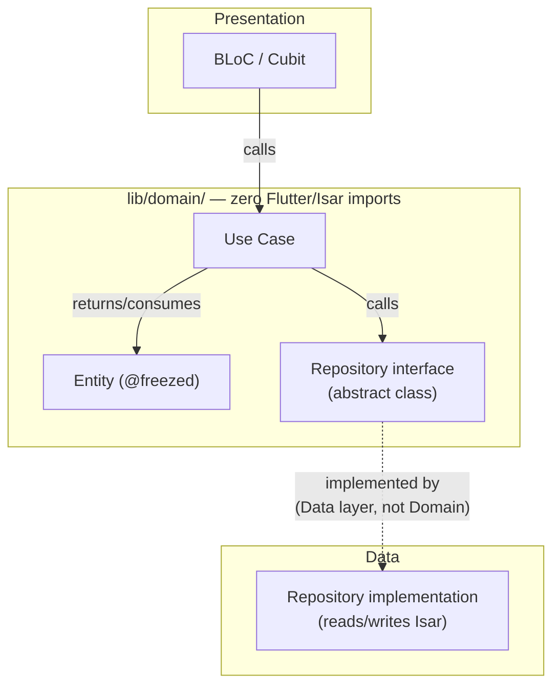

# The Domain Layer — Complete Guide

`lib/domain/`

## The simple version

The domain layer is the part of the app that knows the *rules*, but not the *mechanics*. It knows "a note has content, an author, and optionally a parent it's replying to" — but it has no idea whether that note came from Isar, a Nostr relay, or anywhere else. It knows "publishing a note signs it and enqueues it for relay delivery" — but it doesn't know how signing or enqueueing actually happens under the hood.

This is what makes it testable without a device: nothing in `lib/domain/` imports Flutter or Isar, so every use case can be unit-tested as plain Dart with a fake repository standing in for the real one.



The domain layer only ever holds the **interface** (`abstract class SomeRepository`) — the actual implementation that touches Isar lives in `lib/data/repositories/`, injected in at runtime by `get_it`.

## The four folders

```
lib/domain/
├── entities/        # what the data looks like
├── usecases/        # what operations exist
├── repositories/    # abstract interfaces the data layer must implement
└── inputs/          # parameter bundles for use cases that need more than one arg
```

### Entities — what the data looks like

Immutable, `@freezed abstract class` (Freezed 3.x's mandated pattern — not the old `class` form). An entity is the domain's own shape for a piece of data, independent of how it's stored:

```dart
// lib/domain/entities/note/note_entity.dart (shape)
@freezed
abstract class NoteEntity with _$NoteEntity {
  const factory NoteEntity({
    required String eventId,
    required String authorPubkey,
    required String content,
    required DateTime created,
    String? rootEventId,
    String? replyToEventId,
    // ...
  }) = _NoteEntity;
}
```

`NoteModel` (the Isar class in `lib/data/models/`) has a `toDomain()` extension that builds one of these — the mapping is the only place Isar-specific fields (like `id = Isar.autoIncrement`) get left behind.

### Repository interfaces — the contract, not the implementation

```dart
// lib/domain/repositories/followed_user_repository.dart — the real interface
abstract class FollowedUserRepository {
  Future<Either<Failure, Unit>> followUser(
    String pubkeyHex, {
    String? relayHint,
    String? petname,
  });
  // ...unfollow, getFollowedUsers, etc.
}
```

This is *only* the shape. `lib/data/repositories/followed_user_repository_impl.dart` is what actually opens an Isar transaction — and it's annotated `@Injectable(as: FollowedUserRepository)` so `get_it` hands out the real implementation everywhere the interface is asked for.

### Use cases — one operation, one class

Use cases extend `UseCase<ReturnType, InputType>` (needs an argument) or `NoParamsUseCase<ReturnType>` (doesn't), and always return `Either<Failure, T>` so a caller never has to guess whether something can throw:

```dart
// lib/domain/usecases/followed_user_usecases.dart — the real use case
@lazySingleton
class FollowUserUseCase extends UseCase<Either<Failure, Unit>, FollowUserInput> {
  final FollowedUserRepository _repository;
  const FollowUserUseCase(this._repository);

  @override
  Future<Either<Failure, Unit>> call(FollowUserInput input, {bool cached = false}) =>
      _repository.followUser(input.pubkeyHex, relayHint: input.relayHint, petname: input.petname);
}
```

**File grouping is by feature, not one-class-per-file.** All of a feature's use cases live in one file (`ai_model_usecases.dart`, `manas_usecases.dart`, `onboarding_usecases.dart`, ...) — Single Responsibility applies at the *class* level, not the file level. Don't create a new file for every single use case.

### Inputs — a typed bundle when one argument isn't enough

When a use case needs more than a single primitive, it takes an `Input` object instead of a long, easy-to-mix-up parameter list. These live in `lib/domain/inputs/` and are themselves `@freezed abstract class` (immutable, same rule as entities):

```dart
// lib/domain/inputs/note_input.dart — the real file
@freezed
abstract class ComposeNoteInput with _$ComposeNoteInput {
  const factory ComposeNoteInput({
    required String content,
    required NoteType type,
    String? rootEventId,
    String? replyToEventId,
    @Default([]) List<String> pTagRefs,
    @Default([]) List<String> tTags,
    @Default([]) List<String> mentionEventIds,
  }) = _ComposeNoteInput;
}
```

```
BrahmaCreateBloc builds:
  ComposeNoteInput(content: "...", type: NoteType.text, rootEventId: null, ...)
       ↓
PublishNoteUseCase.call(composeNoteInput)
       ↓
NoteRepositoryImpl reads input.content, input.type, input.rootEventId, ...
```

Not every use case needs an Input class — `FollowNoteUseCase` above just takes a bare `String eventId`, because one argument doesn't need a wrapper. Reach for an Input class specifically when a use case's arguments would otherwise be three or more loose parameters, or when a BLoC needs to build up the arguments across multiple user actions before submitting them all at once (Brahma's compose flow is the clearest example — content, type, and references are gathered incrementally as the user types/attaches/tags, then handed to `PublishNoteUseCase` as one `ComposeNoteInput`).

## Putting it together — one real slice, start to finish

```mermaid
flowchart LR
    Widget["FollowButton widget"]
    BLoC["some Cubit/BLoC"]
    UC["FollowUserUseCase"]
    Iface["FollowedUserRepository\n(interface)"]
    Impl["FollowedUserRepositoryImpl\n(Data layer)"]
    Isar[("Isar: FollowedUserModel")]

    Widget -->|tap| BLoC
    BLoC -->|call(FollowUserInput(...))| UC
    UC -->|"_repository.follow(...)"| Iface
    Iface -.->|"@Injectable(as:)"| Impl
    Impl -->|writeTxn| Isar
```

`FollowUserInput` bundles `pubkeyHex` + optional `relayHint`/`petname`. The use case doesn't know or care that the repository underneath is backed by Isar — it only knows the interface's method signature. That's the whole point of the layer.

## Where to look next

- `lib/domain/entities/` — real entities for every feature (note, profile, manas, gana, ...).
- `lib/domain/usecases/` — grouped-by-feature use case files; `followed_user_usecases.dart` and `note_input.dart`/`share_note_input.dart` are good, small, representative examples.
- `DATA_LAYER.md` / `PRESENTATION_LAYER.md` — what's below and above this layer.
- `CODEBASE_EXPLANATION.md` — how this layer fits between Presentation and Data.
- `CLAUDE.md`'s "Adding a New Use Case" / "Adding a New Repository Interface" sections — the exact boilerplate pattern to copy for a new one.
