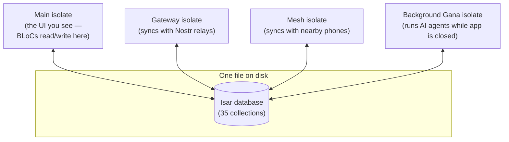
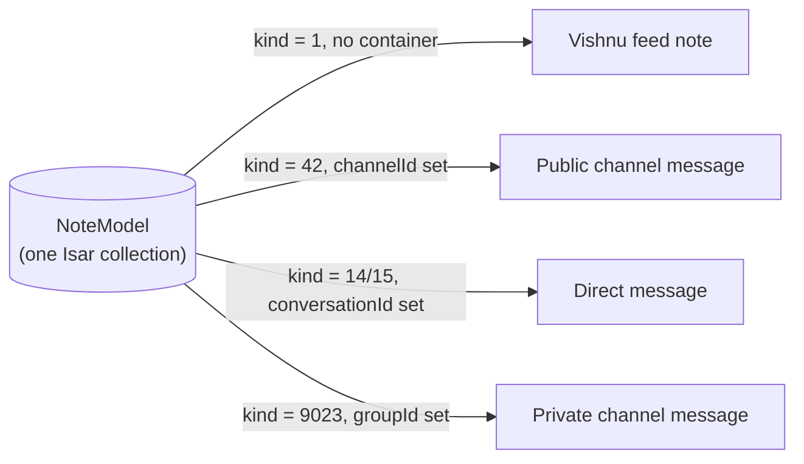

# Isar — UNIUN's Local Database

## The simple version

Isar is the phone's own private database — it lives entirely on the device, in a file inside the app's storage, and never talks to a server by itself. Every screen in UNIUN reads from Isar, not from the network directly. That's what makes the app work with no internet: the feed, chats, saved notes, AI conversations — all of it is just Isar rows on the disk, and the network (the Gateway, described in `CODEBASE_EXPLANATION.md`) is a separate process whose only job is to keep those rows up to date when a connection is available.

Think of Isar as the single shared notebook that four different "workers" (isolates — separate Dart execution threads) all read and write to, instead of passing messages to each other:



None of these four talk to each other directly — there's no `SendPort` message-passing between them for data. They each just open the *same* Isar file independently (`Isar.open(schemas, directory: ...)`), and Isar's own file-level locking keeps writes safe. When the Gateway isolate saves a note it downloaded from a relay, the main isolate's UI updates automatically — not because the Gateway told it to, but because the UI is *watching* that part of the database (see "Reactive queries" below).

## Why Isar, not SQLite or a REST API cache

- **No backend for app data.** UNIUN's core philosophy is "the phone works fully offline" — there is no remote database UNIUN calls to load your feed. Isar isn't a cache in front of an API; for feed/notes/chats/AI history, it **is** the only copy that matters on this device.
- **Object-based, not tables-and-SQL.** You define a normal Dart class, annotate it, and Isar stores/queries it directly — no `SELECT * FROM ...` strings, no manual row-to-object mapping.
- **Reactive by default.** A widget can `.watch()` a query and rebuild automatically the moment matching rows change — this is what makes "Gateway downloads a note in the background → feed updates without a manual refresh" work for free.

## The package: `isar_community`, never `isar`

This is a hard rule, not a style preference: **always** `import 'package:isar_community/isar.dart'`, **never** `import 'package:isar/isar.dart'`. The original `isar` package doesn't work on modern Dart SDKs — this project runs on the community-maintained fork exclusively. Every model file, every repository, every generated schema imports from `isar_community`. If you ever see `package:isar/isar.dart` anywhere in this codebase, it's a bug.

## How it's wired up — one line, one place

```dart
// lib/data/datasources/isar_module.dart
@module
abstract class IsarModule {
  @singleton
  @preResolve
  Future<Isar> createIsar() async {
    final dir = await getApplicationDocumentsDirectory();
    return Isar.open(isarSchemas, directory: dir.path);
  }
}
```

`isarSchemas` (`lib/data/datasources/isar_schemas.dart`) is a flat list of every `@Collection` class's generated schema — currently **35 collections**. Every new Isar model *must* be added to this list, or Isar never creates its table and every query against it fails silently at runtime. This is the single most common mistake when adding a new collection.

The Gateway, Mesh, and background-Gana isolates each run their own tiny copy of this same idea — they call `Isar.open(schemas, directory: sameDir, name: Isar.defaultName)` independently at isolate startup, pointing at the identical directory, so they all end up reading/writing the same physical file.

## What's actually in there — the 35 collections, grouped by what they're for

Isar isn't one giant table — it's 35 independent collections, each a plain Dart class. Grouped by feature area:

| Area | Collections |
|---|---|
| **The unified Note collection** (see below — this is the big one) | `NoteModel` |
| Note metadata (not content) | `SavedNoteModel`, `FollowedNoteModel`, `NoteRelationModel`, `UnreadNoteModel`, `DeletedNoteModel` (tombstones), `PendingExtractionModel` |
| People & relationships | `ProfileModel`, `FollowedUserModel`, `BlockedUserModel`, `MissingProfilePubkeyModel` |
| Channels, private groups, DMs (containers, not messages — messages live in `NoteModel`) | `GroupModel`, `PrivateGroupModel`, `PrivateGroupJoinRequestModel`, `DmConversationModel`, `EncryptedDmModel`, `EncryptedMessageModel` |
| Shiv (AI assistant) | `ShivConversationModel`, `ShivMessageModel`, `AIModelSelectionModel`, `MemoryNodeModel` |
| The knowledge graph (Brahma) | `GraphNodeModel`, `GraphEdgeModel` |
| Ganas (autonomous agents) | `GanaModel`, `GanaRunModel` |
| Nataraj (idea generator) | `NatarajCardModel` |
| Manas (named note collections) | `ManasModel`, `ManasNoteLinkModel` |
| Mesh / offline nearby sync | `SurroundingNoteModel`, `SurroundingTombstoneModel`, `MeshPeerStateModel` |
| Reports & moderation | `ReportModel` |
| Networking plumbing | `RelayModel`, `EventQueueModel` (outgoing publish queue) |
| Media | `MediaCacheModel` |
| Drafts | `DraftModel` |

## The unified `Note` collection — the one thing worth understanding deeply

The single biggest design decision in UNIUN's data layer: **there is no separate model for a feed post, a channel message, a DM, and a private-group message.** They're all rows in one `NoteModel` collection, distinguished by an indexed `kind` field (matching the Nostr event kind) plus whichever container field is non-null for that kind:



Why this matters practically: a single indexed query (`(isSeen, created)`) drives the whole feed, and looking up "what is this note, and where does it belong?" for *any* surface — feed, thread, channel, DM — is one indexed lookup on `eventId`, not four different table joins. `SavedNoteModel` and `FollowedNoteModel` stay as separate small tables because they're metadata *about* a note (a bookmark, a subscription), not the note's content itself.

## Reactive queries — how the UI updates without polling

```dart
// Roughly what the Gateway's watcher hub does (lib/gateway/watchers/isar_watcher_hub.dart)
isar.eventQueueModels.watchLazy().listen((_) => onQueueChanged());
```

`watchLazy()` fires whenever *anything* in that collection changes, without decoding the changed rows (cheap — just a "something changed, go re-query" signal). This is how, for example, the app drawer's unread badge updates the instant a new message arrives, and how the feed picks up new relay-fetched notes without any manual refresh call.

## The one rule that's easy to forget: `writeTxn`

Every write — `put`, `delete`, `clear` — must happen inside `isar.writeTxn(() async { ... })`. Reads don't need one. Forgetting this is the most common Isar bug in a PR review; it either throws at runtime or (worse) silently no-ops depending on the call.

```dart
await isar.writeTxn(() async {
  await isar.noteModels.put(note);
});
```

## Multiple databases, not just one

Isar isn't only used for app content — `lib/data/datasources/tostore_module.dart` also configures **ToStore** (a separate vector-oriented store) specifically for Shiv's note-embedding vectors, since Isar itself has no native vector-similarity search. See `docs/SHIVA/SHIV_AI.md` for how RAG retrieval uses it.

## Where to look next

- `lib/data/models/notes/note_model.dart` — the real `NoteModel` class and its `toDomain()` mapping.
- `lib/data/datasources/isar_schemas.dart` — the authoritative, always-current list of every collection.
- `lib/gateway/watchers/isar_watcher_hub.dart` — the real watcher pattern in production use.
- `DATA_LAYER.md` — the repository/data-source pattern built on top of this database.
- `CLAUDE.md`'s "Data Layer" section — the field-by-field rules for `NoteModel` and the retention policy per kind.
