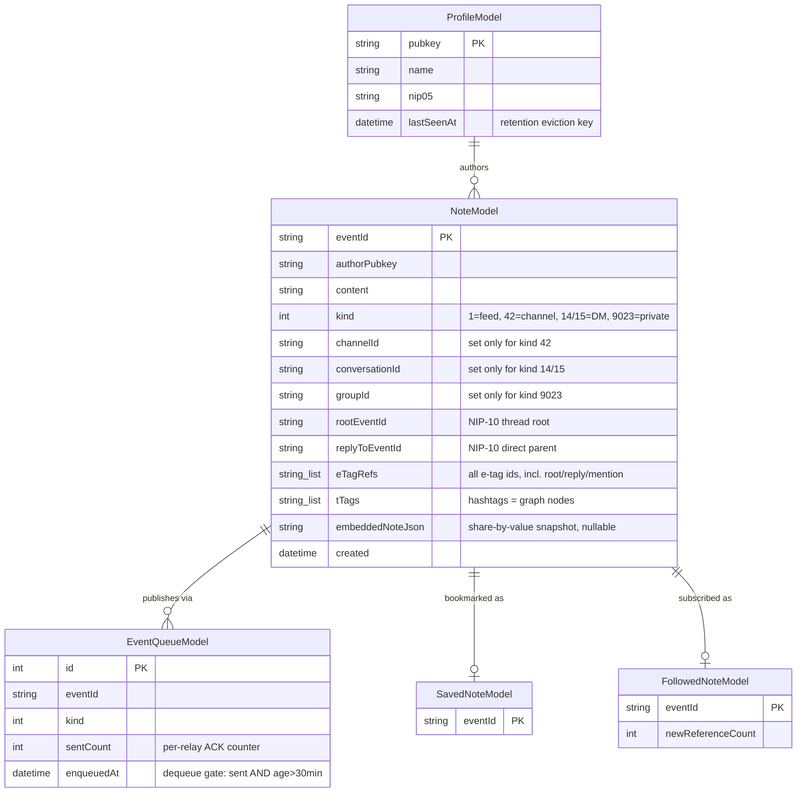

# UNIUN — Low-Level Design Index

## Why this doc looks different now

The previous version of this file (1,788 lines) was a pre-implementation architecture proposal written early in the project — it named fictional classes (`NostrProfile`, `DmMessageModel`, `CentralRelayManager`, `NoteRepository`/`ChannelRepository`/`MessageRepository` as separate interfaces, a `Strategy Pattern AI Model Runner`, an `Embedded Server` facade) that were never built as named, or were built and later refactored into something else entirely (the unified `Note` collection replaced separate note/channel-message/DM models; the Gateway isolate is `orchestrator/`+`transport/`+`session/`+`inbound/`+`outbound/`+`watchers/`, not a single `CentralRelayManager`). Keeping that document around invited exactly the kind of confusion it caused — someone reading it would learn a system that was never actually built.

Every feature area now has its own accurate, current, deep low-level design doc, written and kept up to date alongside the code that implements it. This file is the index into those, plus the one piece of low-level detail that's genuinely cross-cutting: the core shared data model.

## The core shared data model — accurate, as of this doc

This is the whole point of the unified `NoteModel` design: one collection, one indexed lookup, four different UI surfaces (feed, channel, DM, private channel) told apart by `kind` + which single container field is non-null. Full field-by-field detail: `docs/Architecture/ISAR_DB.md` and `CLAUDE.md`'s "Data Layer" section.

## Where each feature's real LLD actually lives

| Area | Doc | What's in it |
|---|---|---|
| Isar / the database layer | `docs/Architecture/ISAR_DB.md` | Schema catalog, multi-isolate sharing, watcher pattern |
| The 3 code layers, big picture | `docs/Architecture/CODEBASE_EXPLANATION.md` | Layer rules, folder structure, a full BLoC-to-Isar trace |
| The data layer specifically | `docs/Architecture/DATA_LAYER.md` | Repository/data-source split, Isar models, `Either`/`Failure` pattern |
| The domain layer specifically | `docs/Architecture/DOMAIN_LAYER.md` | Entities, use cases, repository interfaces, Input classes |
| The presentation layer specifically | `docs/Architecture/PRESENTATION_LAYER.md` | BLoC vs Cubit, `bloc_concurrency` transformers, provider wiring |
| Shiv AI (chat, RAG, backends) | `docs/SHIVA/SHIV_AI.md` | Full RAG pipeline, local/cloud backend split, conversation model |
| Gana (autonomous agents) | `docs/SHIVA/Ganas.md` | Foreground/background engine split, trigger presets, lifecycle |
| LLM task scheduling | `docs/SHIVA/scheduling.md` | The 5-tier CFS/EDF-inspired inference scheduler, full HLD+LLD |
| GraphRAG theory + background | `docs/SHIVA/graphrag.md` | Rationale/theory — see `SHIV_AI.md` for what's actually built |
| Manas (named note collections) | `docs/BRAHMA/Manas.md` | Data model, UI flow |
| Mesh (offline device-to-device sync) | `docs/Mesh/MESH.md` | Transports, handshake, negentropy reconciliation |
| Surrounding (nearby-strangers feed) | `docs/Mesh/SURROUNDING.md` | Trust model, broadcast/inbound flow |
| Public/private groups + DMs | `docs/Messaging/` | The channel→group rename, MLS/Marmot, 3-layer DM encryption |
| QR codes + deep links | `docs/General/QR_AND_DEEP_LINKS.md` | Payload kinds, generation, auth gating |
| Reports / moderation (NIP-56) | `docs/General/REPORTS.md` | The 3-effect submit flow, wire tag shape |
| Media / Blossom | `docs/General/media_subsystem.md` | Upload flow, content-addressed caching |
| The Go relay backend | `docs/Architecture/BACKEND.md` | Khatru, BadgerDB, Blossom handler |
| Nostr protocol usage | `docs/NOSTR/nips.md` | Every NIP UNIUN implements and how |

## Design patterns actually in use (verified, not proposed)

- **Repository pattern** — every data source is hidden behind a domain-layer `abstract class` interface, implemented in the data layer, injected via `get_it`. See `DOMAIN_LAYER.md`.
- **Either-based error handling** (`dartz`) — repository/use-case methods return `Either<Failure, T>` instead of throwing, so every caller handles failure explicitly via `.fold()`.
- **BLoC/Cubit** for presentation state, with `bloc_concurrency` transformers (`droppable`, `sequential`, `restartable`) chosen per event type.
- **Backend dispatch, not Strategy-pattern inheritance** — `LlmRepositoryImpl` picks between `LocalLlmDataSource` and `RemoteLlmDataSource` based on the active `LlmBackendType`, a plain runtime branch rather than a polymorphic Strategy hierarchy. See `docs/SHIVA/SHIV_AI.md`.
