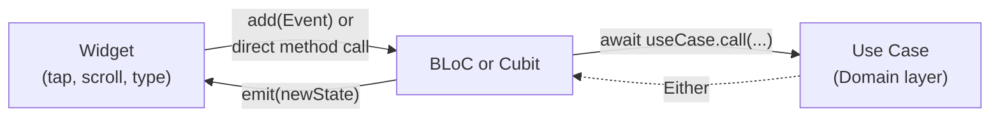

# The Presentation Layer — Complete Guide

`lib/features/*/bloc/` and `lib/features/*/cubit/`

## The simple version

The presentation layer is everything the user actually sees and taps — pages, widgets, and the state-management classes (BLoC or Cubit) that sit between them and the domain layer's use cases. It never touches Isar directly; every read or write goes through a use case (see `DOMAIN_LAYER.md`).



This app uses **both** BLoC and Cubit, on purpose, for different situations — not because of inconsistency. Which one a given feature uses, and why, is the main thing worth understanding here.

## BLoC vs Cubit — the real, verified difference

**BLoC** (`extends Bloc<Event, State>`) is for a feature with more than one *kind* of thing that can happen, especially when some of those things need controlled concurrency (only-one-at-a-time, or cancel-the-old-one-when-a-new-one-arrives). `VishnuFeedBloc` (`lib/features/vishnu/bloc/vishnu_feed_bloc.dart`) is the clearest real example:

```dart
// vishnu_feed_event.dart — a sealed class with named events
sealed class VishnuFeedEvent {}
class FeedOpenedEvent extends VishnuFeedEvent {}
class LoadMoreFeedEvent extends VishnuFeedEvent {}
class MarkFeedItemSeenEvent extends VishnuFeedEvent { final String eventId; ... }
class SaveFeedNoteEvent extends VishnuFeedEvent { final NoteEntity note; ... }
// ...plus two private, internal-only events never dispatched from a widget:
class _NewBufferCountChangedEvent extends VishnuFeedEvent { final int count; ... }
class _FollowedUsersChangedEvent extends VishnuFeedEvent {}
```

Each event is registered with a **transformer** that decides how overlapping instances of that event are handled:

```dart
on<FeedOpenedEvent>(_onOpened, transformer: droppable());
on<LoadMoreFeedEvent>(_onLoadMore, transformer: droppable());
on<MarkFeedItemSeenEvent>(_onMarkSeen, transformer: sequential());
on<SaveFeedNoteEvent>(_onSave, transformer: sequential());
```

- **`droppable()`** — if this event fires again while the previous one is still running, the new one is silently ignored. Used for loads/opens/refreshes: `FeedOpenedEvent`, `LoadMoreFeedEvent`, `LoadNewNotesEvent`, `RefreshFeedEvent` — there's nothing to gain from running a second concurrent page-load, and it would risk duplicate pagination.
- **`sequential()`** — every instance runs to completion, in the order it arrived, none skipped. Used for ordered database mutations: `MarkFeedItemSeenEvent`, `SaveFeedNoteEvent`, `UnsaveFeedNoteEvent` — these write to Isar and mutate in-memory sets like `savedIds` optimistically, so letting two overlap could corrupt state.
- **`restartable()`** — cancel whatever's in flight, start the new one. Used for live-typing search: `SearchMentionsEvent` (`lib/features/brahma/bloc/brahma_create_bloc.dart`) and `ManasFormSearchEvent` (`lib/features/brahma/manas/bloc/manas_form_bloc.dart`) — only the *latest* keystroke's result should ever reach the screen.
- **No transformer** — a plain, synchronous state update with nothing to race (e.g. `_NewBufferCountChangedEvent`, or `GanaFormBloc`'s field-changed events like `on<GanaFormNameChangedEvent>((e, em) => em(state.copyWith(name: e.value)))`).

Across the whole app (verified by grep): **27** uses of `droppable()`, **13** of `sequential()`, **2** of `restartable()`, **0** of `concurrent()` — `droppable()` is the overwhelming default for anything that loads or submits.

**Cubit** (`extends Cubit<State>`) is for a feature where the state transitions don't need an event vocabulary at all — a widget just calls a method directly:

```dart
// select_ai_model_cubit.dart — a real Cubit
class SelectAIModelCubit extends Cubit<SelectAIModelState> {
  Future<void> downloadAndActivate() async { ... }
  void selectModel(AIModelId modelId) { emit(state.copyWith(selectedModelId: modelId)); }
  Future<void> deleteModel(AIModelId modelId) async { ... }
}
```
No `Event` class, no `part 'event.dart'`, no `on<>()` registrations — every public method directly calls use cases and `emit(state.copyWith(...))`. A recurring safety guard shows up throughout: `if (isClosed) return;` after every `await`, because the widget (and its Cubit) can be disposed mid-await.

`BlockedUsersCubit` (`lib/features/settings/cubit/blocked_users_cubit.dart`) shows the pattern doesn't require constructor-injected use cases either — it's just as valid to pull them from the service locator per call: `getIt<GetBlockedUsersUseCase>().call()`.

## State: `@freezed` vs plain hand-rolled class — both are real, both are fine

`VishnuFeedState` is a **plain class** with a hand-written `copyWith`. `SelectAIModelState` is `@freezed`. Both exist in the current codebase; pick whichever the surrounding feature already uses, don't treat one as more "correct" than the other.

## Consuming state — `BlocBuilder` vs `BlocConsumer`

```dart
// Pure render, no side effects — vishnu_feed_page.dart
BlocBuilder<VishnuFeedBloc, VishnuFeedState>(
  builder: (context, feedState) {
    if (feedState.status == VishnuFeedStatus.loading && feedState.items.isEmpty) { ... }
    ...
  },
)

// Render AND react (snackbar, navigation) — ai_model_selection_page.dart
BlocConsumer<SelectAIModelCubit, SelectAIModelState>(
  listenWhen: (prev, curr) => prev.status != curr.status,
  listener: (context, state) { ScaffoldMessenger.of(context)...; Navigator.of(context).maybePop(true); },
  builder: (context, state) { return Scaffold(...); },
)
```

Dispatching into a BLoC reads as `context.read<VishnuFeedBloc>().add(const LoadMoreFeedEvent());` — a Cubit skips the `.add()` entirely and just calls the method: `context.read<SelectAIModelCubit>().downloadAndActivate();`.

## How a BLoC/Cubit actually gets into the widget tree — two real, different patterns

**Pre-built via `get_it`, provided by value** (`lib/features/home/pages/home_page.dart`) — used when the BLoC needs to be created once and kick off an initial event immediately:
```dart
final _vishnuFeedBloc = getIt<VishnuFeedBloc>()..add(const FeedOpenedEvent());
// ...
MultiBlocProvider(
  providers: [BlocProvider<VishnuFeedBloc>.value(value: _vishnuFeedBloc)],
  ...
)
```

**Created lazily at the point of use** (`lib/features/shiv/model_select/pages/ai_model_selection_page.dart`) — the common case for a page-scoped Cubit/BLoC that only needs to exist while that page is on screen:
```dart
BlocProvider(
  create: (_) => getIt<SelectAIModelCubit>(),
  child: const _AIModelSelectionView(),
)
```

## Folder convention — verified across the whole repo

Every feature (and sub-feature) picks **either** `bloc/` **or** `cubit/`, never both in the same folder. Confirmed by listing real feature folders:
- `lib/features/vishnu/` → has `bloc/` (no `cubit/`)
- `lib/features/settings/` → has `cubit/` (no `bloc/`)
- `lib/features/shiv/` → each sub-feature picks its own: `chat/bloc/`, `model_select/cubit/`, `composer_chat/cubit/`, `gana/form/bloc/`

A full scan of every `bloc/`/`cubit/` directory in `lib/features/` (28 total) confirms this split holds everywhere — pick the one that matches the feature's actual need (event vocabulary + concurrency control → BLoC; simple direct calls → Cubit), and follow whichever the nearest sibling feature already does.

## Where to look next

- `docs/Architecture/DOMAIN_LAYER.md` — what a BLoC/Cubit actually calls into.
- `docs/Architecture/DATA_LAYER.md` — what's underneath the use cases.
- `docs/Architecture/CODEBASE_EXPLANATION.md` — the full three-layer picture and folder structure.
- `lib/features/vishnu/bloc/vishnu_feed_bloc.dart` and `lib/features/shiv/model_select/cubit/select_ai_model_cubit.dart` — read these two side by side; they're the clearest real BLoC and Cubit in the codebase.
