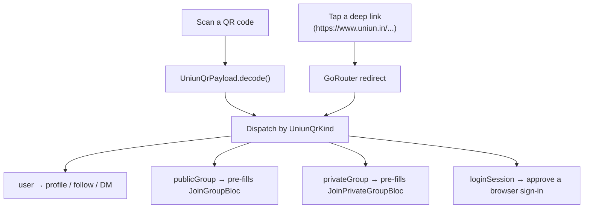

# QR Codes and Deep Links

## The simple version

Both QR codes and deep links (universal/app links, e.g. `https://www.uniun.in/group/<id>`) do the exact same job: hand a decoded payload to the exact same downstream logic a manual "paste an ID" flow already uses. Neither is a separate feature with its own code path — they're both just ways of *entering* the same identifier a user could otherwise type by hand.



## QR payloads — `UniunQrPayload` (`lib/common/qr/uniun_qr_payload.dart`)

Four kinds, verified:
```dart
enum UniunQrKind { user, publicGroup, privateGroup, loginSession }
```

`decode()` recognizes three raw formats, checked in this order:
1. **`nostr:npub1...`** or bare **`npub1...`** — promoted directly to `UniunQrKind.user`, bypassing JSON entirely.
2. **`uniun://qr-login?s=<sessionId>`** (case-insensitive) — the `s` query parameter becomes the session id, kind `loginSession`. This is the one kind the app only ever *decodes*, never generates — it's produced by the UNIUN Cloud web login page, not by this app.
3. Otherwise, plain JSON: `{kind: "user"|"public"|"private"|"login", id, name?, relays?}`.

**Dispatch**, in `UniunQrScannerPage._handleRaw` (`lib/common/qr/uniun_qr_scanner_page.dart`):
- `user` → `_dispatchUser`, which further branches on the scan *intent* (generic profile view, direct-follow, or pre-filled DM compose).
- `loginSession` → `_approveQrLogin` — requires the phone to already be connected to UNIUN Cloud; see `docs/SHIVA/SHIV_AI.md`.
- `publicGroup` / `privateGroup` → routed to the same join pages a manually-typed group id would reach (`AppRoutes.joinGroup` / `AppRoutes.joinPrivateGroup`), passing the decoded payload as `extra`.

## Generating a shareable QR — `UniunQrCard` (`lib/common/qr/uniun_qr_card.dart`)

One widget, four named factories — there is no separate `UniunChannelQrCard` class (an older doc claimed one existed; it's a single `UniunQrCard` with kind-specific factories):
- `UniunQrCard.user()`
- `UniunQrCard.publicGroup()`
- `UniunQrCard.privateGroup()`
- `UniunQrCard.dmConversation()` — two `user`-kind entries with a toggle, for sharing either side of a DM

Rendering uses `QrImageView(data: payload.encode(), ...)`. Sharing rasterizes the QR to a PNG and shares it alongside the equivalent deep link text (`_deepLinkFor(payload)`) — so a recipient who can't scan (e.g. received it as a forwarded image) still has a tappable link. `loginSession` deliberately has no generation path — calling `_deepLinkFor` on that kind throws `UnsupportedError`, since the app never produces that QR, only consumes one shown on a browser.

## Deep links — `lib/core/router/deep_link.dart`

- Host: `www.uniun.in`. Segments: `group`, `private`, `user` — plus a **legacy** `channel` segment (`kLegacyGroupSegment`) kept specifically so old links already in circulation (from before the channel→group rename) still resolve, by 301-redirecting to the canonical `/group/<id>` route.
- Every generated link stamps `?dl=1` — this is how the router tells an *external* deep-link open apart from in-app navigation to the same route.
- `app_router.dart`'s redirect for each deep-linkable route checks `state.uri.queryParameters['dl'] == '1'` first — if it's missing (an in-app push), the gate is skipped entirely. Only external opens run `_deepLinkAuthGate()`:
```dart
Future<String?> _deepLinkAuthGate() async {
  final active = await getIt<GetActiveUserUseCase>().call();
  return active.isLeft() ? '/welcome' : null;
}
```
No active identity → redirected to onboarding instead of the target screen. The group route additionally checks membership (`GetGroupByIdUseCase`) and redirects to the join flow if the user isn't already in that group.

## Where to look next

- `docs/Messaging/GROUPS.md` — what a group QR/link actually joins you into.
- `docs/SHIVA/SHIV_AI.md` — the QR-login approval flow specifically.
- `lib/common/qr/uniun_qr_payload.dart` — read this one file for the complete decode logic.
