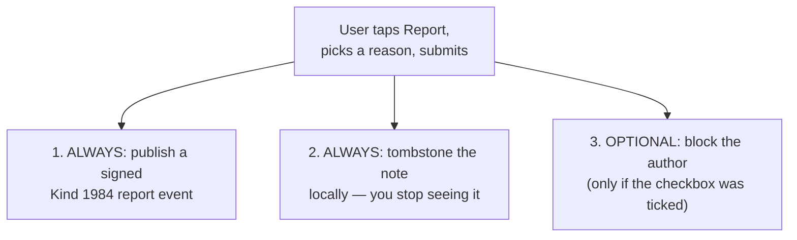

# Reports & Moderation (NIP-56)

## The simple version

Reporting a note or user does three separate things at once, and only one of them is mandatory:



`ReportType` (`lib/core/enum/report_type.dart`) — exactly seven values: `nudity, malware, profanity, illegal, spam, impersonation, other`.

## Who actually does each step — split across two classes

This is worth knowing precisely, since it's split in a way that's easy to miss: `ReportSheetCubit.submit()` (`lib/features/moderation/cubit/report_sheet_cubit.dart`) only performs step 1 (publish) and emits a `submitted` state carrying whether "also block" was checked. Steps 2 and 3 are the **caller's** responsibility — in `note_card_menu.dart`'s `_onReport`:
```dart
await cubit.deleteNote();          // step 2: local tombstone
if (result.alsoBlock) {
  await cubit.blockUser();          // step 3: optional block
}
```
So the cubit itself never hides the note or blocks anyone — it only ever publishes the report and hands back the decision for its caller to act on.

## The wire shape — verified against the actual serializer

`ReportRepositoryImpl._publish` (`lib/data/repositories/report_repository_impl.dart`) builds the tags exactly like this:
```dart
final tags = <List<String>>[
  if (targetEventId != null) ['e', targetEventId, '', type.name],
  ['p', targetPubkey, type.name],
];
```
A note report carries both tags; a user-only report (no specific note) carries just the `p` tag. This is the one exception to UNIUN's normal tag-shaping rules: `EventQueueModel.reportType` being set is what triggers this alternate shape at serialization time (`lib/data/models/event_queue_model.dart`) — the usual NIP-10 root/reply/mention markers are suppressed for a report event, replaced by the report type as the tag's final positional entry.

## What gets persisted locally

`ReportModel` (`lib/data/models/report_model.dart`, `@Name('Report')`):
- `eventId` — unique, replace-indexed; the sha256 hex of the signed Kind-1984 event.
- `reportType` — the `ReportType.name` string.
- `targetEventId` — nullable; null for a user-only report.
- `targetPubkey` — indexed.
- `content` — the free-text reason, if the user added one.
- `created` — indexed.

This is retained forever — it's the user's own moderation history, shown back to them under Settings → My Reports.

## What UNIUN deliberately does not do

UNIUN does not consume or aggregate reports filed by *other* users — there's no client-side "this note has N reports, hide it" logic. NIP-56 itself is explicit that relay-side automated moderation based on report volume is easily gamed by a coordinated pile-on; UNIUN leaves that entirely to the relay operator, if they choose to act on it at all.

## Where to look next

- `lib/features/moderation/cubit/report_sheet_cubit.dart` — the real submit flow.
- `lib/data/repositories/report_repository_impl.dart` — the real tag-building code.
- `CLAUDE.md`'s "Tag-order discipline" note — how the report-type tag shape interacts with every other kind's normal serialization.
