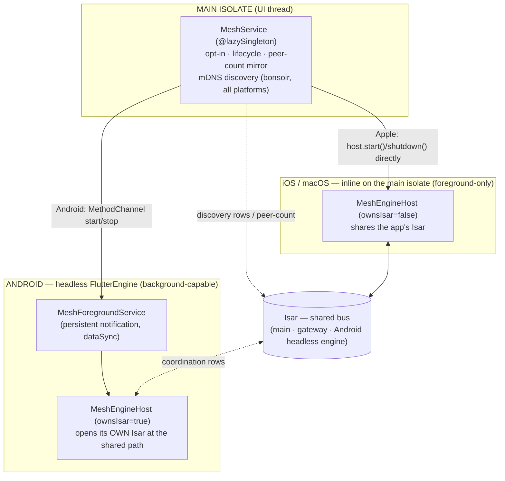
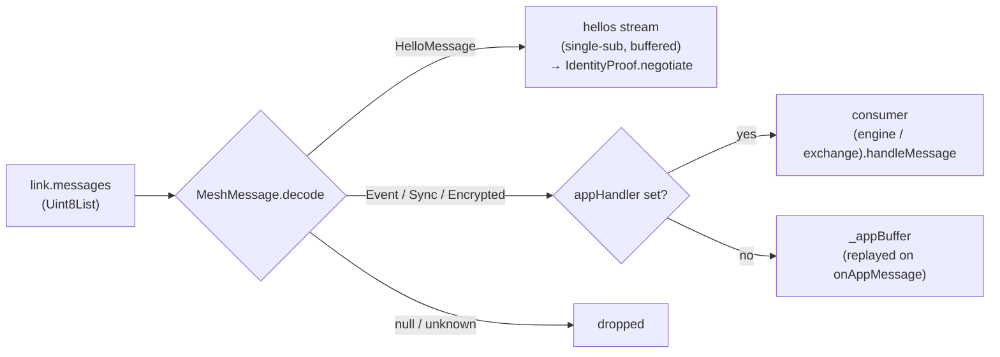
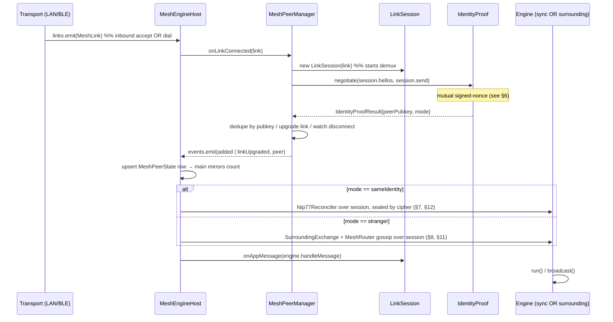
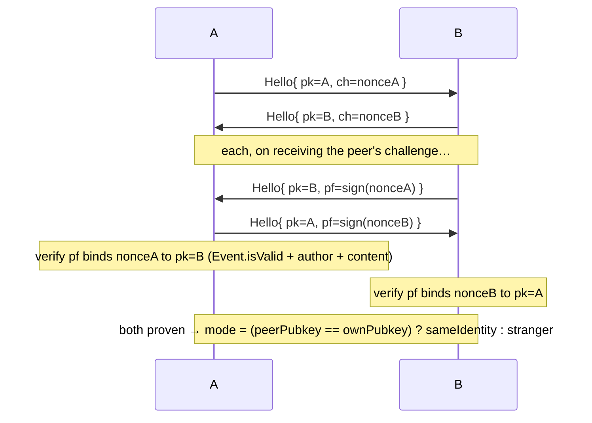
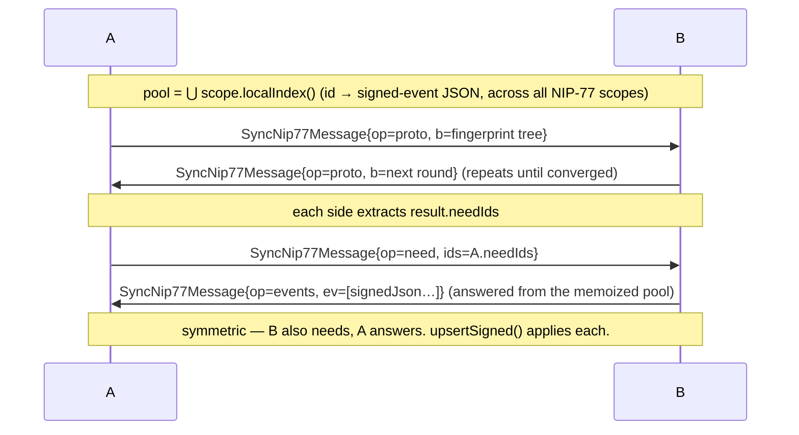
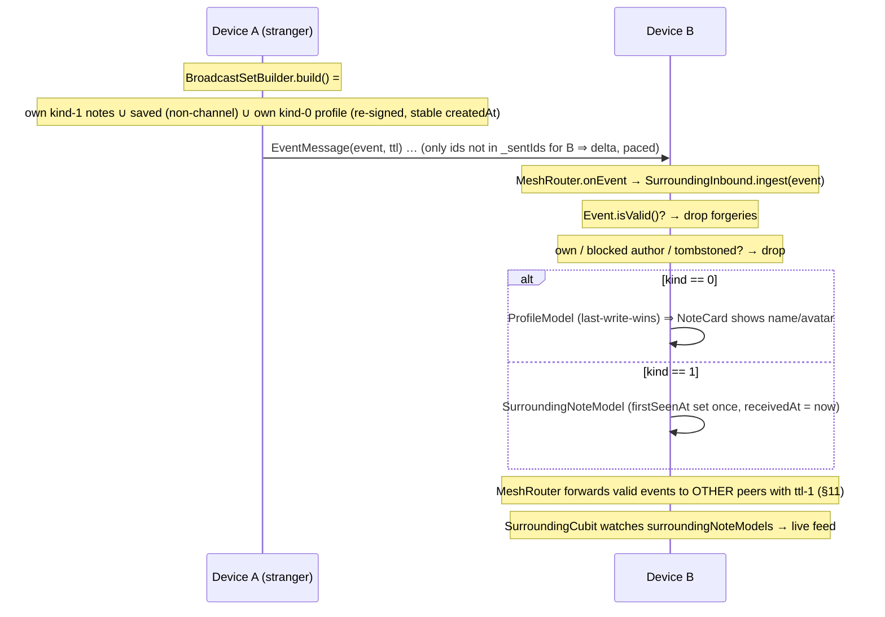
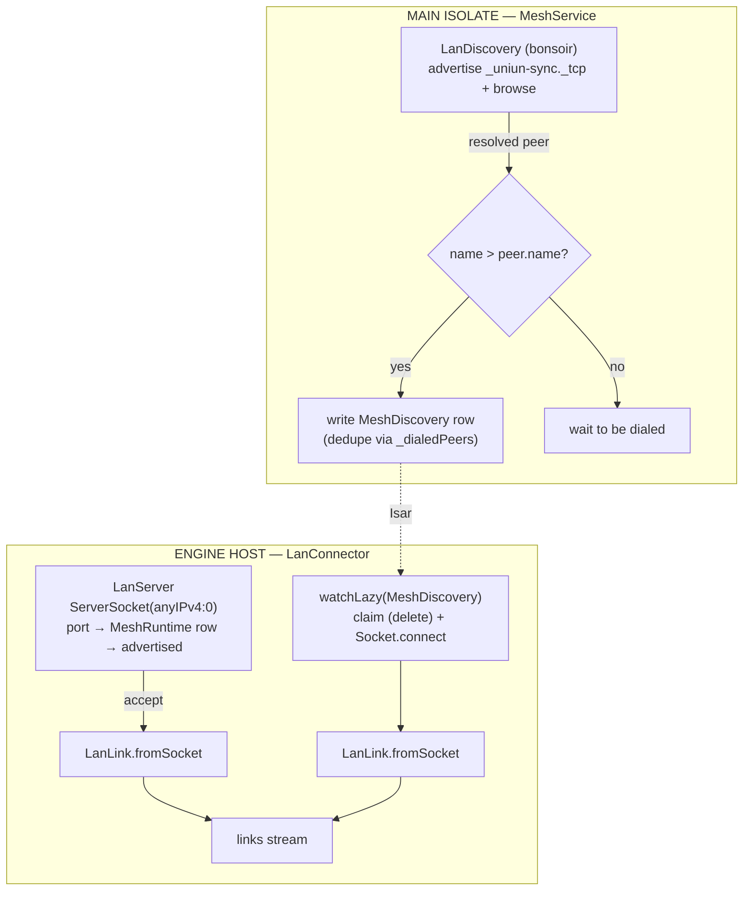
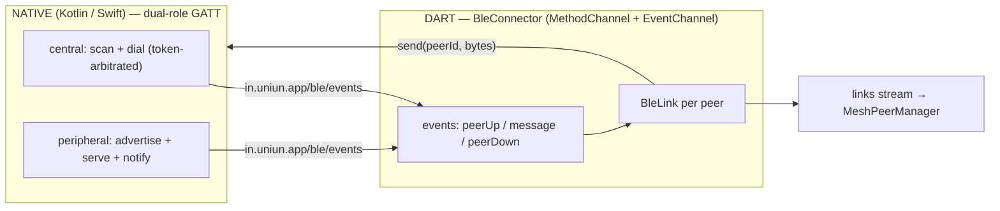
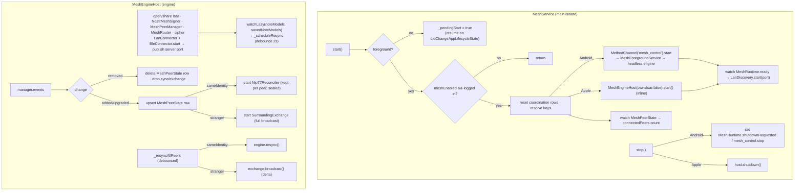

# UNIUN Mesh — Low-Level Design

Offline, multi-transport peer-to-peer layer that lets UNIUN work **without internet**
by exchanging Nostr data directly with nearby devices.

It delivers two user-facing capabilities over the **same** application stack:

1. **Same-identity multi-device sync** — two devices on the same `nsec`, in range,
   reconcile *all* their local content (notes, channels, DMs, bookmarks, follows,
   blocks, profiles, deletion tombstones) over an **encrypted** channel.
2. **Surrounding feed** — devices with *different* identities broadcast their public
   notes to nearby strangers; received notes land in an ephemeral "📍 Nearby" feed
   that's evicted daily. Public events also **gossip** multi-hop beyond direct range.

Which one runs is decided **automatically** by a cryptographic handshake: same proven
pubkey → *sync*, different pubkey → *surrounding*.

> Status: **LAN/Wi-Fi and BLE transports are built and device-verified**, multi-hop TTL
> gossip and same-identity channel encryption are built, same-identity sync runs entirely on
> **signed-event NIP-77 negentropy** — every scope, including all four note surfaces (feed,
> public channel, DM, private channel), reconciles over one pooled negentropy tree
> (see [§7](#7-same-identity-sync-sync)); the legacy id-list `TrustedSyncEngine` has been
> **removed**. **Android background execution** runs via a
> foreground service. The engine is hosted differently per platform (headless `FlutterEngine`
> on Android, inline on Apple — see [§1](#1-layered-architecture)). Multipeer and a general iOS
> background story remain future scope — see [§18](#18-not-yet-built).

---

## 1. Layered architecture

Everything is **transport-agnostic** above a thin seam (`MeshLink`). The application
logic (handshake, sync engine, surrounding exchange, gossip) never knows whether it's
running over Wi-Fi, BLE, or (future) Multipeer.

The whole engine lives in `MeshEngineHost` — **identical code on every platform**. Only
its *host* differs, and that single divergence is captured by two flags:
`MeshService._inline` (which host to use) and `MeshEngineHost.ownsIsar` (whether teardown
closes Isar).



**Why the split.** The engine needs to keep running while the app is **backgrounded**,
which only Android offers a general mechanism for (a foreground service). So:

- **Android** runs `MeshEngineHost` inside a **headless `FlutterEngine`** hosted by
  `MeshForegroundService`. The entry point is `meshEngineMain` in `lib/main.dart` (must be
  a **root-library**, `@pragma('vm:entry-point')` function) → `runMeshEngine()` in
  `mesh_engine_main.dart`. It opens its **own** Isar at the shared path (`ownsIsar = true`),
  reads the identity from secure storage, and runs mDNS + LAN + BLE. `MeshService` drives it
  over `MethodChannel('in.uniun.app/mesh_control')` (`start`/`stop`); the engine exposes a
  control surface over `MethodChannel('in.uniun.app/mesh_engine')` for graceful `shutdown`.
- **iOS / macOS** run `MeshEngineHost` **inline on the app's main isolate** — there is **no
  second engine**. `package:objective_c` (pulled in transitively by `path_provider`'s newer
  versions) corrupts/crashes with multiple `FlutterEngine`s in one process, so a second
  engine is off the table on Apple. `MeshService` constructs
  `MeshEngineHost(_isar, ownsIsar: false)` directly and calls `host.start()` / `host.shutdown()`.
  Native BLE (`UniunBleMesh`, CoreBluetooth) is registered on the **main** engine in
  `AppDelegate` / `MainFlutterWindow`. `runMeshEngine` / `meshEngineMain` / `mesh_control` are
  unused on Apple.

Both share the **two isolates coordinate purely through Isar** discipline that the Gateway
uses: discovery endpoints, a runtime control row, and the connected-peer count travel through
Isar — never a `SendPort`. (On Apple this is moot — it's the same isolate — but the code is
identical.)

> **`path_provider` pin (do not remove).** `path_provider_foundation` is pinned to `2.5.1` in
> `pubspec.yaml` `dependency_overrides`. v2.6+ switched to `package:objective_c` (FFI), which is
> unstable in this app on Apple and was the root cause of recurring `EXC_BAD_ACCESS` crashes. The
> mesh engine on Apple therefore runs `DartPluginRegistrant` on **Android only** and relies on
> native `GeneratedPluginRegistrant` + method-channel defaults elsewhere.

**The seam.** `abstract class MeshLink` is a reliable, ordered, *message-framed* channel to one
peer. Each `messages` item is exactly one whole application message (the transport owns framing).
Every transport implements it; the layers above are identical regardless of which transport won.

---

## 2. Directory map

```
lib/main.dart                         meshEngineMain (@pragma vm:entry-point, Android headless)
lib/features/mesh/
├── mesh_constants.dart           all tuning knobs (TTL, caps, timeouts, pacing, eviction)
├── link/
│   ├── mesh_link.dart            MeshLink, TransportKind, MeshLinkState
│   ├── mesh_peer.dart            MeshPeer, PeerMode
│   └── link_session.dart         per-link demux (Hello vs Event/Sync)
├── payload/
│   └── payload_envelope.dart     MeshMessage {Hello,Event,Sync,Encrypted} wire format
├── handshake/
│   ├── identity_proof.dart       MeshSigner + IdentityProof (signed-nonce)
│   └── nostr_mesh_signer.dart    real secp256k1/Schnorr signer (kind 27492)
├── negotiator/
│   └── mesh_peer_manager.dart    dedupe by pubkey, link upgrade, disconnect
├── router/
│   └── mesh_router.dart          multi-hop TTL gossip (seen-set dedup + forward)
├── security/
│   └── same_identity_cipher.dart HKDF-SHA256 → ChaCha20-Poly1305 channel cipher
├── service/
│   └── mesh_service.dart         @lazySingleton MAIN-isolate controller:
│                                 lifecycle (Android FGS / Apple inline) + mDNS + peer-count
├── engine/
│   ├── mesh_engine_host.dart     MeshEngineHost — the engine (transports, negotiator,
│   │                             sync/surrounding sessions, gossip, cleanup)
│   ├── mesh_engine_main.dart     runMeshEngine() — Android headless-engine entry body
│   └── mesh_identity.dart        reads nsec from secure storage; derives pubkey
├── transport/
│   ├── mesh_transport.dart       MeshTransport seam (implemented by LanConnector/BleConnector)
│   ├── lan/
│   │   ├── lan_framer.dart        length-prefix framing (4-byte BE)
│   │   ├── lan_link.dart          LanLink (Socket) implements MeshLink
│   │   ├── lan_server.dart        ServerSocket
│   │   ├── lan_discovery.dart     bonsoir mDNS advertise/browse  (MAIN isolate)
│   │   └── lan_connector.dart     LanConnector: server + Isar-driven dial
│   └── ble/
│       ├── ble_connector.dart     BleConnector: native dual-role bridge → MeshLink
│       └── ble_link.dart          BleLink (one GATT peer) implements MeshLink
├── sync/                         SAME-IDENTITY reconciliation (NIP-77 negentropy — §7)
│   ├── sync_scope.dart           NegentropySyncScope contract (localIndex/signedEvent/upsertSigned)
│   ├── nip77_reconciler.dart     NIP-77 negentropy reconciler — pooled diff over ALL
│   │                             signed-event scopes (kinds 3050x + 0/3 + 1/42 + 30530)
│   ├── mesh_event_codec.dart     sign + NIP-44 self-encrypt + Schnorr-verify an
│   │                             addressable mesh event (`d`-slot, LWW by created_at)
│   ├── mesh_event_signer.dart    @lazySingleton façade: active identity → bound codec
│   ├── mesh_schema_migration.dart backfill signed events on version bump
│   │                             (kMeshSchemaCurrentVersion = 5)
│   ├── negentropy_sync_scopes.dart  buildNegentropySyncScopes (the single scope list)
│   ├── bodies/                   per-kind cleartext body shape (encode/apply/parse);
│   │                             includes private_note_body.dart (Kind 30530)
│   └── scopes/                   public_event (kind 0/3) · signed_note (kind 1/42, raw
│                                 verbatim) · private_note (kind 14/15/9023, 30530 wrapper) ·
│                                 mesh_record_sync_scope.dart (shared NIP-77 base) ·
│                                 savedNote / followedNote / blockedUser /
│                                 dmConversation / manas / manasMember / gana
│                                 (thin bindings) · signed_event_peek.dart
└── surrounding/                  STRANGER broadcast
    ├── broadcast_event.dart        canonical event reconstruction
    ├── broadcast_set_builder.dart  own+saved notes + own profile (capped, savedAt cursor)
    ├── surrounding_inbound.dart    verify + store (kind 1 → note, kind 0 → profile)
    ├── surrounding_exchange.dart   per-peer delta broadcast (paced)
    └── surrounding_cleanup.dart    daily eviction (on firstSeenAt)

Native BLE (one custom byte-pipe per platform, byte-compatible on the wire):
  android/app/src/main/kotlin/in/uniun/app/
    ├── MeshForegroundService.kt   hosts the headless FlutterEngine + BleController
    ├── MainActivity.kt            mesh_control channel + runtime BLE/notification perms
    └── ble/  BleUuids · BleCommon · BleController · BleFragmenter · BleCentral · BlePeripheral
  ios/Runner/UniunBleMesh.swift    shared CoreBluetooth dual-role impl (see §10)
    └── AppDelegate.swift / macos/Runner/MainFlutterWindow.swift register it on the main engine

lib/data/models/surrounding_note_model.dart    ephemeral cache (firstSeenAt eviction, receivedAt read/paging)
lib/data/models/mesh/mesh_discovery_model.dart  main→engine dial hand-off (claim+delete)
lib/data/models/mesh/mesh_peer_state_model.dart engine→main connected-peer rows (count)
lib/data/models/mesh/mesh_runtime_model.dart    single-row control (server port / shutdown)
lib/data/models/dm/dm_conversation_model.dart   Id = fastHash(otherPubkey)  ← deterministic
lib/core/utils/fast_hash.dart                   FNV-1a 64-bit
lib/data/datasources/surrounding_read_state_store.dart   read watermark (receivedAt, SharedPreferences)
lib/domain/repositories/surrounding_note_repository.dart  (+ impl)  UI read/page/mark-read
lib/features/surrounding/                       cubit (+ state) + page (NoteCard)
lib/features/settings/widgets/mesh_card.dart    opt-in toggle + live peer count
```

---

## 3. The transport seam

```dart
enum TransportKind { lan, multipeer, ble, relay }   // preference: lan>multipeer>ble>relay
enum MeshLinkState { connecting, connected, disconnected }

abstract class MeshLink {
  String get linkId;                 // transport-local id (host:port / peripheral id)
  TransportKind get transportKind;
  Stream<Uint8List> get messages;    // one whole app message per item (single-subscription)
  Stream<MeshLinkState> get states;
  bool get isConnected;
  void send(Uint8List message);      // transport frames it
  Future<void> close();
}
```

`MeshLink.messages` is **single-subscription** (mirrors a paused socket: it buffers until
read). Exactly one consumer reads it — the `LinkSession` demux.

A `MeshTransport` (LAN / BLE / future Multipeer) advertises + discovers and surfaces every
freshly-established connection as a `MeshLink` on its `links` stream. `MeshEngineHost` wires
each transport's `links` into the negotiator the same way, so adding a transport is one more
entry in the host's transport list — nothing above the seam changes.

### LinkSession — the demux

A `MeshLink` carries two conceptually different streams: the **handshake** (Hello messages) and
the **post-handshake app traffic** (Event/Sync/Encrypted). Both must share the one
single-subscription link stream. `LinkSession` owns it and routes:



- `hellos` buffers until the negotiator subscribes (it attaches asynchronously inside
  `IdentityProof.negotiate`), so the opening Hello is never dropped.
- App messages arriving *during* the handshake are buffered and replayed when the post-handshake
  consumer registers via `onAppMessage(handler)`.
- Post-handshake Hellos are ignored (the app phase has started).

---

## 4. Wire format

Every link message is one UTF-8 JSON object `{"v":2,"t":<type>,...}`. `decode` is tolerant —
malformed / wrong-version / unknown-type → `null` (dropped, never throws).

```
sealed MeshMessage (v=2)
├── HelloMessage     t="hello"  { pk, ch?(challenge nonce), pf?(signed proof event) }
├── EventMessage     t="event"  { e: <raw Nostr event JSON>, ttl }   ← surrounding + gossip
├── SyncNip77Message t="nsync"  { op, b?(base64 negentropy frame), ids?[], ev?[] }  ← NIP-77 diff
│                               op ∈ { proto, need, events, done }      (all same-identity scopes)
└── EncryptedMessage t="enc"    { c: <base64 ChaCha20-Poly1305 sealed inner MeshMessage> }
```

`EventMessage.ttl` carries the remaining multi-hop forward budget (`kMeshMaxTtl = 7`); only the
gossip relay reads it. `SyncNip77Message` (`nsync`, pooled negentropy) is the **sole same-identity
reconciliation dialect** — see [§7](#7-same-identity-sync-sync). `EncryptedMessage` wraps a sealed
inner `MeshMessage` and is used **only** on the same-identity sync path (Hello + surrounding stay
plaintext) — see [§12](#12-same-identity-channel-encryption).

### LAN framing (`lan_framer.dart`)

TCP is a byte stream with no message boundaries, so each `MeshMessage` is wrapped:

```
┌────────────┬──────────────────────────────┐
│ len (4B BE)│ payload (the encoded message) │   len ≤ kMeshMaxMessageBytes (8 MB)
└────────────┴──────────────────────────────┘
```

`LanFrameDecoder` is a stateful re-assembler: feed it raw socket chunks (split anywhere), it
yields each complete message exactly once, buffering partial headers/payloads across chunks.
BLE has its **own** fragmentation layer ([§10](#10-ble-transport)); above the seam neither is visible.

---

## 5. Connection lifecycle

All participants below run **inside `MeshEngineHost`** (Android headless engine / Apple main
isolate). The main isolate's `MeshService` only feeds discovery: `LanDiscovery` resolves a
peer → writes a `MeshDiscovery` row → `LanConnector` claims it and dials (or accepts an inbound
socket). BLE discovery + dialing happen natively and surface as ready `BleLink`s.



---

## 6. Identity handshake (`identity_proof.dart`)

A **mutual signed-nonce challenge** proves each side controls the private key behind its claimed
pubkey, and decides the peer mode. The nonce needs *freshness* (anti-replay), not secrecy — the
signature proves key control regardless of who reads it.



The signer is abstracted (`MeshSigner`) so the handshake state machine is unit-tested with a fake.
The production `NostrMeshSigner` signs an **ephemeral kind 27492** event whose `content` is the
challenge, and verifies via `Event.fromJson(verify:false)` + `event.isValid()`
(`Event.fromJson(verify:true)` only `assert`s, which is stripped in release — so we check the
boolean ourselves) + author match + content == challenge.

> Privacy: the pubkey is **never** advertised in the clear (no pubkey in the mDNS TXT or the BLE
> advertisement). It's exchanged only inside the post-connect handshake.

> Hardening noted: over an unencrypted LAN socket a MITM could relay a challenge to the real
> key-holder. Channel binding (TLS) and a BLE Noise channel close this; tracked for a later phase.

---

## 7. Same-identity sync (`sync/`)

Two of a user's own devices reconcile the same local state over the (AEAD-encrypted, §12) channel.
Reconciliation is **entirely NIP-77 negentropy** via a single reconciler — every scope, including
all four note surfaces, rides one pooled fingerprint tree. (The old id-list `TrustedSyncEngine` /
`SyncMessage` dialect has been removed.)

| Reconciler | Dialect | Scopes | Diff strategy |
|---|---|---|---|
| `Nip77Reconciler` | `SyncNip77Message` (`nsync`) | **everything** — 3050x record scopes, `publicEvent` (kind 0/3), `signedNote` (kind 1/42), `privateNote` (kind 14/15/9023) | NIP-77 negentropy over a **pooled** fingerprint tree |

The two note surfaces split by whether the on-device row *is* a stateless-verifiable signed event:

| Scope | Kinds | Wire unit | Verify on receive |
|---|---|---|---|
| `signedNote` | 1 (feed), 42 (public channel) | the **real signed event**, forwarded verbatim (`NoteModel.rawEventJson`) | standard `id = SHA256 && Schnorr sig valid` — foreign authors verify natively |
| `privateNote` | 14/15 (DM), 9023 (private channel) | a **fabricated Kind-30530 self-encrypted wrapper** carrying the decrypted plaintext body (`NoteModel.signedNostrEvent`) | `MeshEventCodec.openRecord` (our own Schnorr sig + NIP-44 self-decrypt) |

Why the split: DM rumors (NIP-17) are deliberately **unsigned/deniable**, and private-channel
messages are **MLS ciphertext** whose decryption needs per-device group state a peer can't
reproduce (forward secrecy deletes the keys; each device is its own MLS leaf). So for those two
surfaces there is no original signed event to forward — instead the already-decrypted plaintext is
re-sealed under a key both same-identity devices share (the NIP-44 self-encrypt off the shared
`nsec`), exactly the `MeshRecordSyncScope` pattern the 3050x records use. Feed and public-channel
notes *are* real signed events, so they forward verbatim like the `publicEvent` (kind 0/3) scope.

`sync_scope.dart` defines the single `NegentropySyncScope` contract every scope implements
(`localIndex` → `signedEvent(id)` → `upsertSigned(json)`); `buildNegentropySyncScopes`
(`negentropy_sync_scopes.dart`) registers them.

### 7a. Signed-event model — the NIP-77 path (primary)

Every mesh-synced record is stored on-device as a **signed, self-encrypted addressable Nostr event**
alongside its normal Isar row. `MeshEventCodec` (bound to the active identity by `MeshEventSigner`)
is the single encode/decode path:

- **Encode (write side).** A repo mutation (save/unsave, follow/unfollow, block, …) calls the codec
  with `(kind, dTag, cleartext-body)`. The codec: builds an addressable event (`d` tag = the record's
  deterministic slot), **NIP-44 self-encrypts** the body into `content` (both devices derive the same
  key from the shared `nsec`), signs it (Schnorr), and returns the event JSON. The repo stashes that
  JSON in the row's `String? signedNostrEvent` column. Signing is best-effort: **no identity ⇒ null
  column**, and `mesh_schema_migration` backfills it later.
- **Decode (read side).** `openRecord(json)` verifies the Schnorr signature + id, NIP-44-decrypts the
  body, and yields a `MeshEventRecord { event, kind, dTag, createdAt, state, content }` where
  `state ∈ {active, removed}` and `content` is the decoded body Map.

**Mesh event kinds** (addressable, `d`-slotted):

| Kind | Scope | `d` slot |
|---|---|---|
| 30500 | `savedNote` | `eventId` |
| 30501 | `followedNote` | `eventId` |
| 30502 | `blockedUser` | `pubkeyHex` |
| 30503 | `dmConversation` | `otherPubkey` |
| 30510 | `manas` | `manasId` |
| 30511 | `manasMember` | `manasId:noteId` |
| 30520 | `gana` | `ganaId` |
| 30530 | `privateNote` | `eventId` (the DM / private-channel note's id) |

The **`publicEvent`** scope is different: it syncs the user's already-signed **real** Nostr events —
kind 0 (profile) and kind 3 (contact list) — verbatim, so there's no 3050x wrapper and no
self-encryption (they're public by nature). This is what replaced the old separate `profile` /
`followedUser` scopes. The **`signedNote`** scope works the same way for the *real signed* note
kinds (1 feed, 42 public channel): it forwards `NoteModel.rawEventJson` verbatim and the peer
verifies by the standard id+sig rule. Only the **`privateNote`** scope (kind 14/15/9023) uses the
self-encrypted 30530 wrapper, because those surfaces have no forwardable signed original.

**Reconciliation.** `Nip77Reconciler` runs one negentropy session over a **pool** of all
negentropy scopes' events (kind-agnostic — the `nip77` package diffs by `(id, created_at)`):



- **Need-only (deliberate).** A side only ever **requests** (`need`) the ids negentropy says it
  lacks; it never proactively **pushes** ids the peer lacks. Because the peer runs the same diff
  symmetrically it will emit its own `need`, so every event lands **exactly once per pair** — the
  proactive push is skipped to avoid duplicate deliveries (documented in `nip77_reconciler.dart`).
- **LWW by `created_at`.** `upsertSigned` decodes the incoming event, finds the existing row, and
  keeps the **higher `created_at`** (ties broken by the event that's already local). A row with **no
  signed event yet** (fresh unsigned edit / migration-backfilled) has nothing to compare, so the
  first incoming event wins — safe, because an unsigned row was never advertised on the mesh.
- **Tombstone / undo.** Unsave / unfollow / unblock keep the row and set `@Index() DateTime? removedAt`
  + re-sign with a **newer `created_at`** and `state=removed`. Re-saving re-signs again newer. LWW
  therefore converges the latest intent across devices — a delete never resurrects, an undo always wins.

### 7b. `MeshRecordSyncScope<T>` — the shared base

The seven record scopes (savedNote … gana) are **~50-line thin bindings** over one base class
(`scopes/mesh_record_sync_scope.dart`). The base owns everything generic:

- `localIndex()` — scans this kind's signed rows, builds the id→JSON out-map, **and stashes a
  run-scoped `_runIndex` memo** (id→signedJson) for this reconciliation round.
- `signedEvent(id)` — served from the `_runIndex` memo (O(1)); falls back to a full scan +
  `SignedEventPeek.tryPeek` only when called without a preceding `localIndex()` (unit tests). The set
  of ids a peer can `need` is exactly the set advertised in `localIndex()`, so the memo is a pure
  optimization — correctness is call-order-independent. Each scope instance owns its own memo (no
  cross-scope / cross-test leakage).
- `upsertSigned(json)` — codec-open (reject → drop) → kind guard → `writeTxn`: findExisting → LWW →
  `applyBody` (per-row `try/catch`, one bad row can't roll back the batch) → stamp the signed column
  → put the row.

Each binding supplies only the kind-specific hooks: `meshKind`, `signedRows()`, `signedJsonOf(row)`,
`findExisting(...)`, `applyRecord(...)` (delegates to the matching `bodies/*Body.applyBody`),
`putRow(...)`, `stampSigned(...)`. This is the F6 refactor — it collapsed seven near-identical
~150-line scopes into one tested base + seven bindings.

### 7c. Note sync — `signedNote` (verbatim) + `privateNote` (wrapper)

The unified `Note` collection covers four surfaces. They split across two negentropy scopes by
whether the on-device row is a stateless-verifiable signed event.

**`signedNote` (kind 1 feed, kind 42 public channel).** Real signed Nostr events. The scope
advertises `{eventId → created_at}` for rows that carry `NoteModel.rawEventJson` and forwards that
raw JSON verbatim; `upsertSigned` verifies `event.isValid()` (id + Schnorr), skips locally
tombstoned ids (`DeletedNoteModel`, no resurrection), then delegates to the **same relay inbound
handlers** (`Kind1NoteHandler` / `Kind42Handler`) so mesh-inbound and relay-inbound converge on the
same terminal state (reply edges, `rawEventJson` re-stamp). `rawEventJson` is populated at ingress:
the inbound handlers stash the raw event, and an own optimistically-inserted note is backfilled from
its relay echo (a bare row without it is simply not advertised until then). It then writes an
**unconditional** unread row — a note synced from your other device is new to *this* device, so it
surfaces in the feed banner even for own-authored notes (the relay handler's "skip own" guard would
wrongly suppress it — same rationale as the old `NoteSyncScope`).

**`privateNote` (kind 14/15 DM, kind 9023 private channel).** No forwardable signed original, so the
decrypted plaintext body is carried in a fabricated **Kind-30530** self-encrypted addressable event
(`d = eventId`), via `PrivateNoteBody` over the shared `MeshRecordSyncScope` base. Signing is
**centralized in the scope**: `localIndex()` first fabricates a wrapper for any DM/private row whose
`signedNostrEvent` is still null (using the scope's `MeshEventCodec`), then advertises the signed
rows. This is deliberate — the code paths that *create* these rows (inbound DM decrypt, outbound
`sendDm`, Marmot MLS receive/send) need no access to the Nostr `nsec` (Marmot's background watcher
has none). On receive, `applyRecord` rebuilds the `NoteModel` from the body and `putRow` writes the
note + a **skip-own** unread row + reply edges, honoring tombstones. The DM FK
`NoteModel.conversationId` is `fastHash(otherPubkey)` — deterministic across devices — so it
transfers verbatim; the matching `DmConversation` row reconciles via its own Kind-30503 scope.

Both note scopes are re-runnable and idempotent (unique `eventId` index). Because a note is
content-addressed and immutable, per-id LWW is trivial (a note either exists or it doesn't).

> **Phase 6 note.** The old **`deletedNote`** scope (local-hide, Kind 30504) was removed — hiding a
> note is a device-local UI preference, not a cross-device intent. `DeletedNoteModel` still lives
> on-device (the gateway reads its `eventId` set to drop inbound events for hidden notes) but no
> tombstone is broadcast to peers.

### 7d. Schema migration (`mesh_schema_migration.dart`)

When the app boots at a schema version below `kMeshSchemaCurrentVersion` (**5**), the migration pass
**retro-signs** every existing row that has no `signedNostrEvent` yet, so records created before the
signed-event layer (or while logged out) become mesh-syncable. Versions map to the phases that
introduced each kind: v1 SavedNote(30500); v2 FollowedNote(30501)/BlockedUser(30502)/
DmConversation(30503); v3 Profile(kind 0)/FollowedUser(kind 3) via `publicEvent` (no 3050x backfill —
they're already signed relay events); v4 Manas(30510)/ManasMember(30511); v5 Gana(30520). The pass is
a no-op once `meshSchemaVersion == 5`.

### Re-runnable

One reconciler pair is kept **per same-identity peer** for the session. When local content changes,
`resync()` re-arms the per-round state over the *same* session — it does **not** rebuild the engine or
re-register the link handler. The first round is `run()`; later rounds are `resync()`. Re-runs are
idempotent.


---

## 8. Surrounding feed (`surrounding/`)



The Surrounding feed is UNIUN's **offline discovery surface**: notes from *strangers* in radio/Wi-Fi
range, no shared identity, no relay. It is deliberately the mirror image of same-identity sync —
**untrusted, public, ephemeral, multi-hop** — and reuses the same transports, negotiator, and gossip
router. The presentation lives in `lib/features/surrounding/` ("📍 Nearby").

**Broadcast set (`broadcast_set_builder.dart`).** `build()` assembles what *this* device offers a
stranger, newest-first and capped:

- own **kind-1 notes** (`kMaxOwnBroadcastNotes = 10`),
- **saved** non-channel notes (`kMaxSavedBroadcastNotes = 10`) — content this user vouched for,
- own **kind-0 profile**, re-signed from `ProfileModel` with a **stable `createdAt = updatedAt`** so
  re-ingest on the peer is idempotent (last-write-wins by pubkey, never a growing pile).

The saved-note slice is cursored by **`savedAt`** (not row id) so "what's new since last broadcast"
is a monotonic time delta that survives across sessions and row-id churn.

**Canonical reconstruction (`broadcast_event.dart`).** Notes from strangers are untrusted, so every
inbound event must pass `Event.isValid()` (recomputed id + Schnorr). For our *own* outbound notes to
verify on the peer, `buildBroadcastEvent` rebuilds tags in the **exact canonical order** used by
`EventQueueModel.toSerializedRelayMessage` (e:root → e:reply → e:mention → p → t → q). A saved note
that some other client signed in a different tag order won't re-serialize to the same id and is
**dropped before send** (safe — just not propagated). So own notes always propagate; saved notes
propagate when reconstructable.

**Inbound (`surrounding_inbound.dart`).** `ingest(json)` is the untrusted gate, in order:
1. parse (malformed → drop); **own pubkey → drop** (never ingest our own echo);
2. **kind guard** — only kind 0 or kind 1 (`kNoteKind`) proceed;
3. **flood guard** — a rolling `kSurroundingMaxNotesPerSecond` (2/s) cap, checked *before* the Schnorr
   verify so a note flood can't burn CPU on signatures we'll drop. **Applies to kind-1 notes only**;
   kind-0 profiles are exempt (idempotent LWW by pubkey);
4. **`Event.isValid()`** — recomputed id + Schnorr (forgeries dropped);
5. store: kind 0 → `ProfileModel` upsert (name/avatar for `NoteCard`); kind 1 → `SurroundingNoteModel`
   after a `writeTxn` re-check for blocked author / tombstoned / locally-removed id.

A `true` return means "valid public event worth relaying" — independent of local storage, so a valid
note from a blocked author still **relays** (blocking is a local-view choice) but isn't stored here.

> **Known limitation (not hardened in this phase).** Because the per-second cap gates only kind-1,
> a peer could stream many *distinct-pubkey* kind-0 profiles and each would pass straight to the
> Schnorr verify + a `ProfileModel` upsert. In practice a stranger only ever legitimately broadcasts
> **one** profile (their own), so this is a low-severity abuse surface; a kind-0 rate limit is a
> tracked follow-up, not yet applied.

**Delta + pacing.** One `SurroundingExchange` is kept per peer. First `broadcast()` sends the full
capped set; later ones send only ids not in `_sentIds` (the delta). Sends are paced
`kSurroundingSendInterval` (600 ms) apart, matching the receiver's 2/s guard so a well-behaved sender
never trips it.

**Ephemeral cache + eviction.** `SurroundingNoteModel` (`@Name('SurroundingNote')`, unique-replace on
`eventId`) is a throwaway cache — evicting it is **not** a `deleted` field and doesn't violate Feed
Freedom. It carries two indexed timestamps with distinct jobs:

- **`firstSeenAt`** — set **once**, the first time this id is stored, and never moved. Eviction keys
  off it: `SurroundingCleanup.evictFirstSeenBefore(now − kSurroundingRetention)` (1 day) runs on
  startup + every `kSurroundingCleanupInterval` (1 h). Because it's immutable, a note that keeps
  getting re-broadcast **can't extend its own retention** — it still ages out one day after first
  contact.
- **`receivedAt`** — bumped on every (re-)receipt. It drives feed ordering, paging
  (`getBefore`/`getAfter`, `kSurroundingPageSize = 10`), and the unread watermark.

**Read state / unread.** `SurroundingReadStateStore` persists a single `receivedAt` watermark in
SharedPreferences (a timestamp, **not** a `lastReadEventId` — an id pointer could reference an
already-evicted note; a timestamp survives eviction). A surrounding note is unread iff
`receivedAt > watermark`; `markReadUpTo(ts)` only ever advances it. `SurroundingCubit` watches
`surroundingNoteModels` for the live feed and exposes the unread count + "jump to first unread",
mirroring the feed/channel/DM read model.

**Rendering.** `SurroundingNoteModel.toDomain()` produces a plain `NoteEntity`; the **"📍 Nearby"
source tag is localized at the presentation layer** (`SurroundingFeedPage`), not stored in the data
layer. The standard `NoteCard` renders it; bookmarking a nearby note **saves** it (promotes it into
forever-retained saved notes, out of the ephemeral cache's reach).

**Multi-hop.** Valid inbound events are forwarded to *other* peers with `ttl − 1` by `MeshRouter`
([§11](#11-multi-hop-gossip-routermesh_routerdart)), so a stranger's note reaches beyond direct
range.

---

## 9. LAN transport (`transport/lan/`)

The LAN transport is **split across the discovery/socket boundary**: mDNS lives on the main
isolate via `MeshService` (`bonsoir` is a platform channel), the sockets live in `MeshEngineHost`
(on Android, sockets can't cross into the headless engine's isolate, so the dial hand-off goes
through Isar; on Apple it's all one isolate but the code is identical). They hand off through the
`MeshDiscovery` Isar table.



- **Discovery (main):** mDNS/DNS-SD via `bonsoir`. Advertises only the service UUID + a random
  per-launch instance name (**no pubkey**), using the server port the engine publishes in the
  `MeshRuntime` row. Skips self by name.
- **Directional dialing:** only the **higher** instance name dials; the other accepts. Guarantees
  one stable connection (avoids the cross-dial race). Repeated mDNS resolutions are deduped.
- **`LanLink`:** wraps a `Socket`; `send` length-frames, inbound is de-framed by `LanFrameDecoder`.
  Write errors are swallowed so a peer reset mid-send doesn't surface as an unhandled
  `SocketException`; the read side drives state.
- **Permissions:** iOS/macOS `NSLocalNetworkUsageDescription` + `NSBonjourServices`; macOS
  `network.server` entitlement; Android `INTERNET` / `ACCESS_NETWORK_STATE` /
  `CHANGE_WIFI_MULTICAST_STATE`.
- **Network-change recovery (no app restart):** bonsoir's mDNS sockets are bound to the interface
  that existed at `start()`, so a **Wi-Fi switch** leaves them on the now-dead interface and
  discovery silently stops. `MeshEngineHost` watches `connectivity_plus`
  (`onConnectivityChanged`) and, when the device's **non-loopback IPv4 set actually changes**
  (verified via `NetworkInterface.list` — debounced 1.5 s past the wifi→none→wifi burst), rebinds
  the LAN layer **in place**: `LanConnector.restartServer()` rebinds the TCP server on the new
  interface (keeping the `links` stream alive), `_dialedPeers` is cleared, and discovery
  re-advertises under a **fresh instance name** so a peer that *didn't* change network treats us as
  a newly-arrived peer (getting past its own dial-once dedupe). Dead LAN sockets self-evict when
  their reads error. BLE is untouched. This works in both hosts (Apple inline / Android headless —
  `connectivity_plus` is registered there by `DartPluginRegistrant`, same as bonsoir).

> **Limitation — mobile hotspots break LAN.** Phone tethering (Android hotspot, **iOS Personal
> Hotspot** especially) runs with **AP/client isolation** by default: it drops multicast/broadcast
> between clients and firewalls client↔client unicast. Both LAN steps die — mDNS discovery never
> reaches the peer (the `CHANGE_WIFI_MULTICAST_STATE` perm only helps if the *AP* forwards
> multicast; a hotspot doesn't), and even a known peer IP can't be dialed. "Both on the same Wi-Fi"
> is true at the SSID level but false at L2/L3. **BLE ([§10](#10-ble-transport)) is the working
> transport in this case** — it's radio-to-radio and never touches the IP network, so isolation is
> irrelevant. For LAN specifically you need a real AP that bridges clients and forwards multicast
> (a home router or a travel router in AP mode — not phone tethering).

---

## 10. BLE transport (`transport/ble/` + native)

Unlike LAN (a raw socket the engine owns), **BLE's data path is itself a platform channel**, so
the native side owns the radio and exposes a byte pipe; the Dart `BleConnector` turns each native
peer into a `BleLink implements MeshLink`. The engine above the seam is unchanged.



- **Channels:** method `in.uniun.app/ble` (`start`/`stop`/`send`/`disconnect`), event
  `in.uniun.app/ble/events` (`peerUp`/`message`/`peerDown`). On Android these are bound on the
  **headless engine** by `MeshForegroundService`; on Apple on the **main engine** by
  `AppDelegate`/`MainFlutterWindow`. Missing-plugin → `BleConnector` is a silent no-op (e.g. test
  hosts), so the engine still runs LAN-only.
- **Dual-role:** every device is **both** central (scans + dials) and peripheral (advertises +
  serves a single write/notify characteristic on our service UUID).
- **Dial arbitration:** a random 4-byte per-launch **token** rides the advertisement — Android in
  manufacturer data, Apple in the local name (CoreBluetooth can't advertise manufacturer data, so
  each central reads whichever is present). Only the **higher-token** side dials; ties break
  deterministically (on MAC address on Android). This elects exactly one connection per pair.
- **Fragmentation (the one genuinely-hard bit, borrowed from bitchat):** a GATT write/notification
  carries only an MTU-sized chunk, so each whole app message is split with a **6-byte big-endian
  header** `[msgId u16][fragIndex u16][fragCount u16]` and reassembled per-peer. The header layout
  is **byte-identical** across Kotlin and Swift so fragments interoperate cross-platform. One
  message is in flight per peer (no interleave). The reassembler caps total size at 8 MB
  (mirrors `kMeshMaxMessageBytes`).
  > The MTU→payload math differs **intentionally** per platform: Android subtracts `3 + HEADER`
  > (its `onMtuChanged` reports the raw ATT_MTU), Apple subtracts only `HEADER` (CoreBluetooth's
  > `maximumWriteValueLength` already nets the 3-byte ATT header). Both reach the same usable
  > payload — don't "unify" them.
- **Shared Swift.** iOS and macOS are separate Xcode targets but use **one** `UniunBleMesh.swift`
  (conditional `import Flutter` / `import FlutterMacOS`) added to both, so the ~440-line
  CoreBluetooth implementation can't drift between platforms.
- **Permissions:** Android `BLUETOOTH_SCAN`/`_CONNECT`/`_ADVERTISE` (12+) or `ACCESS_FINE_LOCATION`
  (older) + `POST_NOTIFICATIONS` (13+), requested at runtime in `MainActivity`; the foreground
  service uses `dataSync` + a connected-device BLE permission at start. iOS
  `NSBluetoothAlwaysUsageDescription` + `bluetooth-central` background mode.
  > **First-run gotcha:** the very first BLE start can fire before permissions are granted; a mesh
  > off→on toggle after granting fixes it. **iOS Simulator has no Bluetooth — BLE is testable only
  > on real devices.**

---

## 11. Multi-hop gossip (`router/mesh_router.dart`)

`MeshRouter` turns the point-to-point surrounding exchange into a **flood**: a public event hops
A → B → C beyond direct range, while each event is processed and relayed **at most once**.

For an inbound `EventMessage` from a peer it:
1. **dedupes** by event id against a bounded seen-set (`kMeshRouterSeenCap = 8192`, FIFO — the
   loop/amplification guard),
2. **verifies + stores** it via the link's ingest (a `SurroundingInbound.ingest`),
3. if it was a valid public event **and** its TTL isn't exhausted, **forwards** it to every *other*
   stranger/mesh peer with `ttl - 1`.

Same-identity peers are never gossiped to (their content rides the trusted sync), and the source is
never echoed back. The origin broadcast starts at `kMeshMaxTtl = 7`; a receiver at ttl 0 stores but
does not forward — bounding multi-hop flooding.

---

## 12. Same-identity channel encryption (`security/same_identity_cipher.dart`)

The same-identity sync channel carries **decrypted** DM and profile rows, so it must never be
cleartext on the wire. `SameIdentityCipher` seals it:

- **Key:** HKDF-SHA256 from the shared private key (`nsec`) with a fixed non-empty salt
  (`uniun-mesh-hkdf-salt-v1`) + info (`uniun-mesh-same-identity-v1`). Both of a user's devices
  derive the **same** key — no key exchange needed.
- **AEAD:** ChaCha20-Poly1305 (`cryptography_plus`), fresh nonce per seal; `open` returns null on
  auth failure (dropped).
- **Scope:** only the same-identity path. `MeshEngineHost` seals each `Nip77Reconciler` outbound
  message into an `EncryptedMessage` and opens inbound ones before handing the inner `MeshMessage`
  to the engine. **Hello and surrounding stay plaintext** (the handshake establishes identity; the
  surrounding feed is public by design).

> A salt/info change would require a protocol-version bump and an interop window — there is no
> version negotiation in the handshake yet, so treat these constants as frozen.

---

## 13. Negotiator (`mesh_peer_manager.dart`)

Owns the proven peers, keyed by Nostr pubkey (cross-transport identity).

- **`onLinkConnected(link)`** → wrap `LinkSession` → `IdentityProof.negotiate` → on success
  register/update the `MeshPeer`.
- **Dedupe + upgrade:** if the same pubkey is already known, a link at **≥** the current
  transport's `preference` **replaces** the old one (the `==` case is a same-transport reconnect —
  the existing link is likely stale, so the fresh handshake wins); strictly inferior links are
  dropped. This is also the **cross-transport dedup** point: the same peer seen over both LAN and
  BLE collapses to one `MeshPeer` (LAN wins on preference).
- **Disconnect:** `_watchDisconnect` subscribes to the link's state; on `disconnected` it evicts
  the peer (no-op if the session was already replaced). This is what makes a restarted peer
  reconnect cleanly.
- **`events`** (broadcast): `added | linkUpgraded | removed` drive `MeshEngineHost`.

---

## 14. Lifecycle — MeshService (main) + MeshEngineHost (engine)

Orchestration is split. `MeshService` (`@lazySingleton`, started from `main.dart`) is a thin
**main-isolate controller**; `MeshEngineHost` owns the **engine** and reactivity. Gated by the
**opt-in** flag (`AppSettingsStore.meshEnabled`) + a logged-in user + foreground (Android 12+
blocks starting a foreground service from the background). Default off (privacy/battery).



**Spawn handshake (Android).** `MeshService` resets coordination rows, asks the foreground service
to start the headless engine, then waits (via a `MeshRuntime` Isar watch) for the engine to bind
its `LanServer` and publish its port — only then does it advertise over mDNS. A `_generation` token
makes a rapid toggle-during-spawn safe. On Apple, `start()` calls `host.start()` directly (same
`MeshRuntime` port hand-off, same isolate).

**Live propagation.** The engine watches `noteModels` + `savedNoteModels` (deliberately **not**
`profileModels` — inbound surrounding profiles land there, so watching it would loop). On change →
debounced `_resyncAllPeers`: same-identity peers `resync()` the kept engine; stranger peers send
the **delta**. New notes appear on the other device in ~2 s without an app restart.

**Graceful teardown.** Toggling Nearby off stops mDNS and tears down the engine: close sockets,
dispose the negotiator/router/cipher, clear the `MeshPeerState` rows, and — **only when
`ownsIsar`** (Android headless) — `isar.close()` before the engine exits. On Apple the app's shared
Isar is never closed. The next `start()` begins from wiped coordination rows.

**Status:** `connectedPeers` (`ValueNotifier<int>`) feeds the Settings card's live count — mirrored
from the engine-maintained `MeshPeerState` rows (a `ValueNotifier` can't cross the isolate
boundary, so the count travels through Isar).

---

## 15. Data model touched

| Collection | Key / id | Role |
|---|---|---|
| `SurroundingNoteModel` (`@Name('SurroundingNote')`) | `eventId` (unique, replace) | ephemeral nearby-note cache; `firstSeenAt` (immutable) drives daily eviction, `receivedAt` drives read/paging |
| `MeshDiscoveryModel` (`@Name('MeshDiscovery')`) | `instanceName` (unique, replace) | main→engine dial hand-off; engine claims (delete) + dials; cleared on start/stop |
| `MeshPeerStateModel` (`@Name('MeshPeerState')`) | `pubkeyHex` (unique, replace) | engine→main connected peers; **presence == connected**; main watches `.count()` for the UI |
| `MeshRuntimeModel` (`@Name('MeshRuntime')`) | fixed `id = 0` | single-row control: `serverPort` + `ready` (engine→main) and `shutdownRequested` (main→engine) |
| `DmConversationModel` | `id = fastHash(otherPubkey)` | deterministic id ⇒ DM `conversationId` FK is identical across devices |
| `Note`, `SavedNote`, `NostrProfile`, `FollowedUser`, `FollowedNote`, `BlockedUser`, `UnreadNote`, `Manas`, `ManasNoteLink`, `Gana` | existing | reconciled by the sync scopes (§7); reused, not re-modelled. Signed-event scopes gained a `String? signedNostrEvent` column (the cached 3050x mesh event) + `@Index() DateTime? removedAt` (tombstone/undo). `Note` additionally gained **`String? rawEventJson`** (the verbatim signed event, for kind 1/42 `signedNote` sync) and reuses **`signedNostrEvent`** for the fabricated Kind-30530 wrapper (kind 14/15/9023 `privateNote` sync). `DeletedNoteModel` also lives on-device (gateway suppression set) but is **not** synced — see §7. |

All new `@Collection`s are registered in `lib/data/datasources/isar_schemas.dart` and opened in
every host that touches Isar (main, gateway, and the Android headless engine). The three `Mesh*`
collections are pure cross-isolate coordination state — not domain data, not synced to peers.

---

## 16. Security & trust model

| Path | Trust | Check |
|---|---|---|
| Handshake | — | mutual signed-nonce; proof must bind *our* nonce to the *claimed* pubkey |
| Same-identity sync | trusted (authenticated to own key) | channel is the auth; transport is **AEAD-encrypted** (§12) |
| Surrounding inbound | untrusted | `Event.isValid()` (id+Schnorr) + blocked + tombstone + not-own |
| Gossip relay | untrusted | dedupe by id; only valid public events forwarded, TTL-bounded |
| Advertisement | — | no pubkey in mDNS or BLE adv; identity only after connect |

---

## 17. Testing

`test/mesh/` + `test/surrounding/` — the full host-VM suite (**~230 tests**):

- **Pure Dart:** payload envelope round-trips (`SyncNip77Message` / `EventMessage` / `HelloMessage`
  / `EncryptedMessage`); identity proof
  (same/stranger/forged/timeout); negotiator (register/upgrade/inferior-drop/reconnect-replace/
  disconnect-evict); LAN framing (chunking edge cases); router
  (dedup/TTL/no-echo/same-identity-skip); same-identity cipher (ChaCha20-Poly1305 round-trip / AEAD).
- **Signed-event layer:** `MeshEventCodec` sign + NIP-44 self-encrypt + Schnorr round-trips and
  reject paths (bad sig/id, foreign kind, malformed); `bodies/` encode↔apply round-trips per kind;
  each record scope (`savedNote`…`gana`) — `localIndex`/`signedEvent`/`upsertSigned`, LWW by
  `created_at`, tombstone/undo; `publicEvent` kind-0/kind-3; **`signedNote`** (kind 1/42 verbatim —
  valid insert + unconditional unread, tampered-sig drop, tombstone no-resurrect) and
  **`privateNote`** (kind 14/15/9023 30530 wrapper — pending-row signing, DM/private round-trip,
  skip-own unread); `Nip77Reconciler` pooled convergence; `mesh_schema_migration` backfill.
- **Real secp256k1:** `NostrMeshSigner` proof/verify (forged sig / wrong challenge / wrong pubkey /
  tampered content rejected).
- **Real Isar + real keypairs (integration):** two temp Isar DBs converge notes / saved / DMs
  (deterministic conv-id) / profiles / follows / blocks / manas / gana **+ unread rows**; surrounding
  propagates a verified note **+ author profile**, drops forgeries, skips own.
- **Real loopback TCP:** full handshake through `LanLink` over a real socket.

Run: `flutter test test/mesh/ test/surrounding/`. (Isar integration tests skip gracefully if the
native core can't initialize.) **Not unit-tested** (device-only or untested gaps): the BLE native
bridge, the Android-headless vs Apple-inline host split, and `MeshService` lifecycle gating.

> Under full parallel load the native Isar core occasionally races across the per-open salted temp
> DBs, so one signed-event scope test may flake in a whole-suite run; each passes in isolation. It's a
> harness-concurrency artifact, not a logic regression.

---

## 18. Not yet built

- **Multipeer transport (iOS + macOS).** `MCSession` as a `MultipeerLink implements MeshLink` for
  off-network Apple-to-Apple. **Apple-only — it never connects to Android.** LAN already covers
  iPhone↔Mac / iPhone↔iPhone whenever they share a Wi-Fi network, so Multipeer's *unique* value is
  narrow: off-network Apple-to-Apple (it uses AWDL peer-to-peer Wi-Fi) at much higher throughput
  than BLE. If that scenario (two Apple devices, no shared Wi-Fi, large sync) matters it's a clean
  moderate-effort add — one more entry in the engine's transport list, the layers above the seam
  unchanged. If not, LAN + BLE already cover the common cases and it's mostly redundant.
- **General iOS background execution.** Android background liveness runs today via the foreground
  service hosting the headless engine. iOS has **no general background service** — LAN/mDNS/TCP are
  suspended when backgrounded, so **LAN is foreground-only on iOS**. BLE is the only transport with
  a (limited, opportunistic) iOS background story via `bluetooth-central` `UIBackgroundModes` +
  CoreBluetooth state restoration (state restoration not yet wired).
- **LAN channel binding** (TLS) to close the MITM-relay gap noted in §6.
- **Broadcast-set cap tuning** and a **kind-0 flood cap** on the surrounding inbound (the current
  per-second guard covers kind-1 only — see §8). Foreign saved-note authors' names still can't be
  broadcast verifiably to *strangers* (only our own profile re-signs); they fill in from the relay
  when online. Same-identity peers already exchange kind-0 via the `publicEvent` scope.
- **Handshake protocol versioning** so the cipher salt/info (§12) and wire format can evolve
  without an interop break.

---

## 19. End-to-end at a glance

```
toggle Nearby ──▶ MeshService.start (main, gated: opt-in + logged-in + foreground)
   Android ─▶ MethodChannel mesh_control.start ─▶ MeshForegroundService ─▶ headless FlutterEngine ─▶ MeshEngineHost
   Apple   ─▶ MeshEngineHost(ownsIsar:false).start()  (inline, main isolate)
   engine ─▶ LanConnector binds server + BleConnector starts ─▶ publishes port (MeshRuntime row)
   MeshService advertises+browses mDNS (bonsoir, main) ; BLE scans/advertises (native)
   discover peer ─▶ (LAN) write MeshDiscovery row ─▶ engine claims+dials  |  (BLE) native token-arbitrated dial
      ─▶ LinkSession ─▶ signed-nonce handshake
      same pubkey  ─▶ AEAD-sealed same-identity sync (§7) ─▶ Isar ─▶ feed/DMs/…
                      └▶ NIP-77 negentropy (nsync) over one pooled tree: signed 3050x records
                         (savedNote…gana) + kind0/3 (publicEvent) + kind1/42 raw (signedNote) +
                         kind14/15/9023 30530 wrapper (privateNote)
      diff  pubkey ─▶ SurroundingExchange: verify+store kind1/kind0 ─▶ SurroundingNote ─▶ 📍 feed
                     └▶ MeshRouter forwards valid events to other peers (ttl-1) ─▶ multi-hop reach
   connected ─▶ MeshPeerState row ─▶ main mirrors connectedPeers count
   write a note ─▶ Isar watcher (engine) ─▶ debounced resync() / delta-broadcast ─▶ peers (no restart)
   peer drops ─▶ _watchDisconnect evicts ─▶ delete MeshPeerState row ─▶ reconnect replaces stale link
   toggle off ─▶ teardown ─▶ (Android only) isar.close() ─▶ engine exits
```
