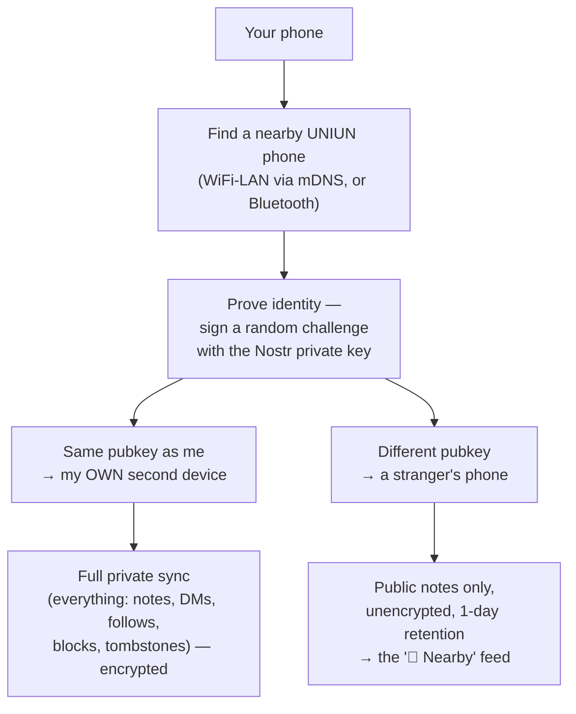

# Mesh — Offline Peer-to-Peer Sync

This folder covers everything about UNIUN syncing directly with nearby devices — no internet, no relay. It's one system (`lib/features/mesh/`) that does two distinct jobs depending on *who* it finds nearby.

## The simple version

Every mesh connection — over WiFi-LAN or Bluetooth — runs the exact same identity handshake first. **Same identity, different device → sync.** **Different identity → Surrounding.** Nothing about the transport changes between the two; only what happens after the handshake differs.

## Which doc do I actually want?

| I want to know... | Read |
|---|---|
| How discovery, transports, the wire format, the identity handshake, and same-device sync (NIP-77 negentropy reconciliation) actually work | **`MESH.md`** |
| How the "📍 Nearby" stranger feed works — trust model, broadcast/inbound flow, ephemeral eviction, gossip | **`SURROUNDING.md`** |
| The plain-English, no-jargon version for someone who isn't reading code | `docs/UNIUN.md`'s "Mesh & Surrounding" section |

## What's shared vs. what's specific to each half

**Shared (documented once, in `MESH.md`):** peer discovery (mDNS for LAN, native BLE), the transport layer (`lib/features/mesh/transport/`), the identity handshake (`lib/features/mesh/handshake/`), multi-hop gossip routing, and the negotiator that decides sync-mode vs. surrounding-mode per connection.

**Same-identity sync only:** full NIP-77 negentropy reconciliation across every note surface (feed, public channel, DM, private channel), `SameIdentityCipher` encryption (ChaCha20-Poly1305, keyed via HKDF from the shared privkey — since both devices already hold the same secret, there's no key exchange to do). Detailed in `MESH.md` §7 and §12.

**Surrounding only:** the untrusted inbound gate, the ephemeral 1-day-eviction cache, broadcast pacing/rate-limits, and the explicit decision to send Surrounding traffic **unencrypted** (the content is already-signed public Nostr events, so there's nothing to protect). Detailed fully in `SURROUNDING.md`.

## What's genuinely not built yet

Per `MESH.md` §18 (kept current, cross-checked against the code): Multipeer transport (iOS/macOS AWDL) is a `TransportKind.multipeer` enum placeholder only — no real implementation exists. CoreBluetooth state restoration, LAN channel binding (TLS), handshake protocol versioning, and a kind-0-flood cap on Surrounding inbound are all still open. None of these block the shipped LAN/BLE + same-identity-sync + Surrounding feature set — they're hardening/expansion work.

## Where the actual code lives

- `lib/features/mesh/` — engine, transport (LAN + BLE), handshake, negotiator, router (gossip), security (ciphers), sync (the NIP-77 reconciliation scopes), and the surrounding broadcast/inbound logic.
- `lib/features/surrounding/` — thin UI only (`SurroundingFeedPage`, `SurroundingCubit`). All the actual Surrounding protocol logic lives under `lib/features/mesh/surrounding/`, not here — this folder is just the "📍 Nearby" tab's presentation layer.
