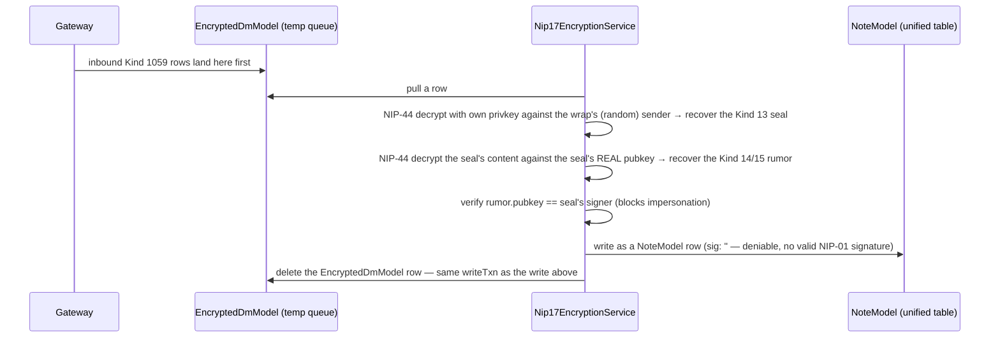

# Direct Messages (NIP-17) — the 3-layer encryption, in code

## The simple version

A DM is never sent as itself. It's wrapped three times before it ever touches a relay, and unwrapped three times on arrival:

```mermaid
flowchart LR
    Rumor["Kind 14 — the rumor\nyour actual message text\nUNSIGNED"]
    Seal["Kind 13 — the seal\nNIP-44 encrypted rumor\nSIGNED by you"]
    Wrap["Kind 1059 — the gift wrap\nNIP-44 encrypted seal\nsigned by a THROWAWAY key"]
    Relay[("Relay sees only:\nKind 1059, one [\"p\", recipient] tag")]

    Rumor -->|"NIP-44 encrypt"| Seal
    Seal -->|"NIP-44 encrypt with a fresh\nephemeral key"| Wrap
    Wrap --> Relay
```

Why three layers and not one: the seal proves *who really sent it* (it's signed with your real key) without the relay ever seeing that signature — the relay only sees the outer gift wrap, signed by a key that's used exactly once and thrown away. Even *that* you're messaging someone is hidden from anyone but the recipient — the only visible metadata on the relay is one `["p", recipientPubkey]` tag.

## The real class: `Nip17EncryptionService`

Everything above is implemented in one class — `lib/domain/services/nip17_encryption_service.dart` (412 lines). There is no separate "GiftWrapService"; this is it.

### Sending (`sendDm`)

```mermaid
sequenceDiagram
    participant Sender
    participant Svc as Nip17EncryptionService
    participant Queue as EventQueueModel

    Sender->>Svc: sendDm(recipientPubkey, text)
    Svc->>Svc: build Kind 14 rumor (unsigned; id = sha256 of the array, since it's never actually signed)
    Svc->>Svc: NIP-44 encrypt rumor → Kind 13 seal, signed with sender's real key
    Svc->>Svc: NIP-44 encrypt seal → Kind 1059 gift wrap, signed with a FRESH throwaway key
    Svc->>Queue: enqueue the Kind 1059 event for relay delivery
```

### Receiving (`processInboundQueue`)



That last step is the important architectural fact: **`EncryptedDmModel` is purely a temporary inbound queue.** It exists only between "the Gateway received a Kind 1059" and "this service finished decrypting it" — the decrypted result lives permanently in the same unified `NoteModel` collection every other surface uses (kind 14/15, `conversationId` set), not in a separate `DmMessageModel` table. (You may find a stale doc comment inside `encrypted_dm_model.dart` itself claiming the decrypted output becomes a `DmMessageModel` — that class doesn't exist; the mechanism the comment describes is real, the destination table name in it is outdated.)

## The two Isar models involved

- **`EncryptedDmModel`** (`lib/data/models/dm/encrypted_dm_model.dart`) — `eventId` (unique), `sig`, `authorPubkey`, `pTagRef`, `content` (still-encrypted), `kind` (expected 1059), `created`. Rows are transient — created on inbound, deleted the moment they're decrypted.
- **`DmConversationModel`** (`lib/data/models/dm/dm_conversation_model.dart`) — `id` derived via `fastHash(otherPubkey)` (deterministic — the same conversation gets the same id on every device, no coordination needed), `otherPubkey` (unique, replace), `relays`, `signedNostrEvent` (a mesh mirror copy for offline sync), `removedAt`.

## Unread tracking and the relay subscription

DMs use the same unified `UnreadNoteModel` mechanism as every other surface — there is no separate `DMReadStateModel`.

```json
// lib/gateway/subscriptions/providers/dms_subscription.dart
{"kinds": [1059], "#p": ["myPubkey"]}
```
No `since` window and no companion filters — every gift wrap ever addressed to this pubkey is fetched.

## Where to look next

- `docs/Messaging/GROUPS.md` — the other two messaging surfaces (public + private groups).
- `docs/Messaging/README.md` — what's shared across all three.
- `docs/Architecture/DATA_LAYER.md` — the general repository/data-source pattern this service's callers sit inside.
