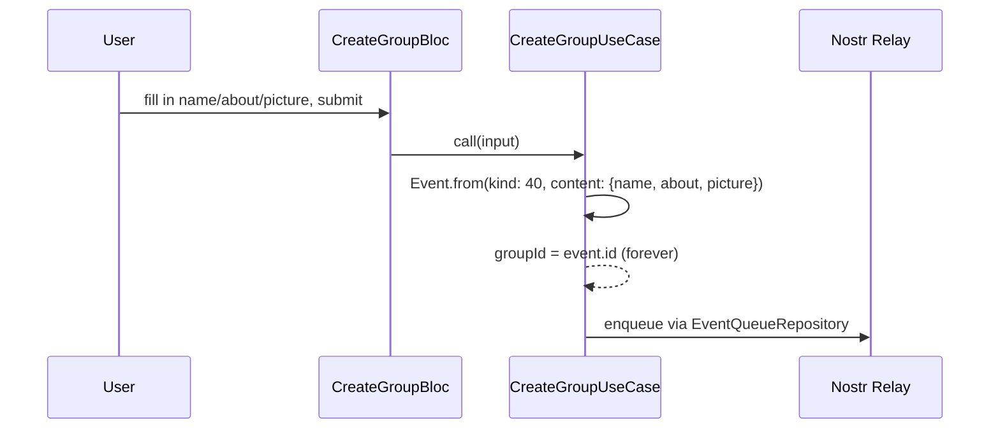
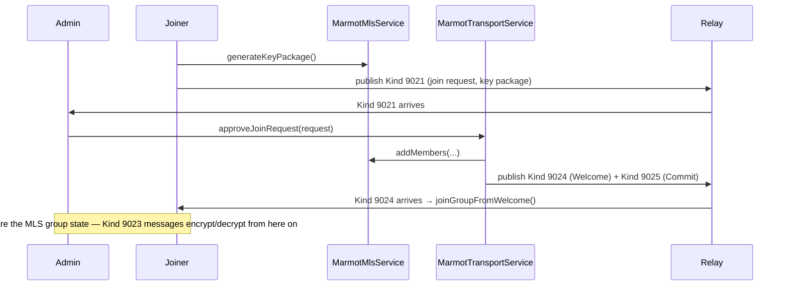

# Groups — Public (NIP-28) and Private (NIP-29 + MLS)

## Public groups — the simple version

A public group is nothing more than: one Kind-40 event whose `id` becomes the group's permanent identifier, and a stream of Kind-42 events tagged to that id.



**Where the code lives** (verified, real paths):
- `lib/features/groups/{create,join,feed,thread}/bloc/` — `CreateGroupBloc`, `JoinGroupBloc`, `GroupFeedBloc`.
- `lib/domain/usecases/create_group_usecase.dart` — builds and signs the Kind-40 event, sets `groupId = kind40.id`.
- `lib/domain/usecases/create_group_message_usecase.dart` — builds Kind-42, tagged `["e", groupId, "", "root"]`.
- `lib/data/models/group_model.dart` — `GroupModel` (`groupId`, `creatorPubKey`, `name`, `about`, `picture`, `relays`, `createdAt`, `updatedAt`, `lastMetaEvent`, `signedNostrEvent` — a mesh mirror copy, `removedAt` — tombstone).

**Metadata updates (Kind 41)** are handled entirely on the inbound side, not by anything the user's own client triggers for others: `Kind41Handler` (`lib/gateway/inbound/handlers/kind41_handler.dart`) only applies an incoming Kind-41 if `event.pubkey == group.creatorPubKey` **and** `event.createdAt > group.updatedAt` — an out-of-order or forged metadata update is silently ignored.

**Joining** — `JoinGroupBloc` takes a 64-hex group id in a text field. A QR scan or a `/group/<id>` deep link does exactly one thing: pre-fills that same text field. There is no separate "join via QR" code path — scanning and typing converge on the identical `SubmitJoinGroupEvent`.

## Private groups — MLS end-to-end encryption

Private groups use **MLS (Messaging Layer Security)** — the same cryptographic protocol family used by Signal/Matrix-style group encryption — via the `openmls` Dart package, wrapped by two internal services:



**Where the code lives:**
- `lib/features/private_groups/{create,join,detail}/bloc/` — `CreatePrivateGroupBloc`, `JoinPrivateGroupBloc`, `PrivateGroupDetailBloc`.
- `lib/domain/services/marmot_mls_service.dart` — `MarmotMlsService`, the thin wrapper around `openmls`'s `MlsEngine`. Opens a **SQLCipher-encrypted** database (`mls_data.db` in the app's documents directory) with a random 32-byte encryption key stored in `FlutterSecureStorage` under `uniun_mls_db_key`. Public surface: `generateKeyPackage`, `createGroup`, `encryptMessage`, `decryptMessage`, `addMembers`, `joinGroupFromWelcome`, `processProtocolMessage`, `leaveGroup`.
- `lib/domain/services/marmot_transport_service.dart` — `MarmotTransportService`, the Nostr-facing orchestrator on top of the MLS engine: `createGroup`, `joinGroup`, `leaveGroup`, `sendGroupMessage`, `approveJoinRequest`.
- `lib/data/models/private_group_model.dart` — `PrivateGroupModel` (`groupId` — NIP-29 `<host>'<group-id>` format, `mlsGroupId` — the OpenMLS-internal id, `relays`, `name`, `description`, `adminPubkey`, `signedNostrEvent` — mesh mirror, `removedAt`).
- `lib/data/models/private_group_join_request_model.dart` — `PrivateGroupJoinRequestModel` (`eventId`, `groupId`, `senderPubkey`, `keyPackageB64`, `timestamp`, `handled: bool`). Rows are **never deleted** — only flagged `handled` — specifically so a re-synced Kind 9021 (e.g. after a relay resync) can't be processed twice.

**Wire kinds, verified**: 9021 = join key-package request, 9023 = application message (`kPrivateGroupKind` in `lib/core/notes/note_kinds.dart`), 9024 = Welcome, 9025 = Commit, 9002 = group metadata (also `["h", groupId]` routes all of these to the right group, per NIP-29).

**Admin approval, concretely**: `MarmotTransportService.approveJoinRequest` calls `MarmotMlsService.addMembers(...)`, publishes the resulting Welcome (Kind 9024) and Commit (Kind 9025), then marks every pending join-request row from that sender `handled` (deduped via key-package identity so a duplicate request can't be approved twice).

## Gateway subscriptions (verified filters)

```json
// Public groups — lib/gateway/subscriptions/providers/groups_subscription.dart
{"kinds": [42], "#e": ["...joined groupIds"], "since": "..."}
// companions (uncapped): {"kinds":[40],"ids":[...groupIds]}  {"kinds":[41],"#e":[...groupIds]}

// Private groups — private_groups_subscription.dart
{"kinds": [9023], "#h": ["...joined groupIds"], "since": "..."}
// companions: {"kinds":[9002],"ids":[...groupIds]}  {"kinds":[9021,9022,9024,9025],"#h":[...groupIds]}
```

## Where to look next

- `docs/Messaging/DMS.md` — the other encrypted messaging surface.
- `docs/Messaging/README.md` — the shared patterns across all three surfaces.
- `docs/General/QR_AND_DEEP_LINKS.md` — how joining by QR/link actually works.
