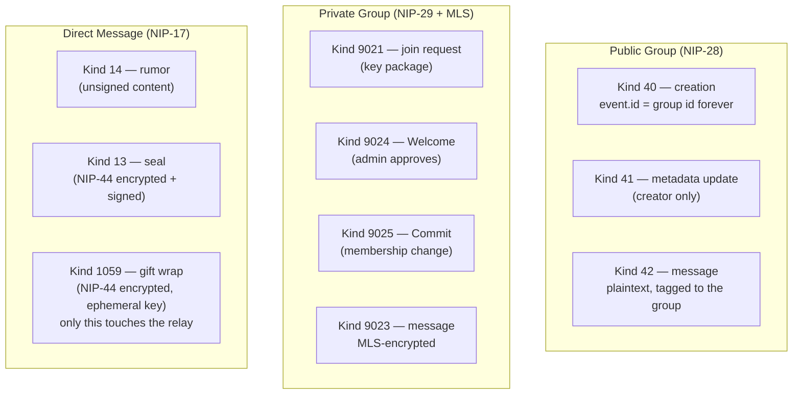

# Messaging — Public Groups, Private Groups, and DMs

This folder covers UNIUN's three online (relay-based) messaging surfaces. All three store their messages in the exact same Isar collection as the feed — `NoteModel`, discriminated by `kind` — so nothing here is a separate "message" concept; it's all still just Notes. See `docs/Architecture/ISAR_DB.md` for that unification.

## The rename you need to know about first

Every one of these features was originally called "Channel"/"Private Channel" in this codebase. It has since been **fully renamed to "Group"/"Private Group"** — folders, BLoC/Cubit class names, route names, and the text users actually see all say "Group" today. The only place the old name survives is as an Isar `@Name('Channel')`/`@Name('PrivateChannel')` annotation, which exists purely to keep the on-disk database schema name stable across the rename (renaming the Isar `@Name` would require a data migration; renaming the Dart-facing symbols didn't). If you find "Channel" naming anywhere else in this codebase or its docs, it's stale — flag it.

## The three surfaces at a glance

| | Who can read it | Encrypted? | Who's it for |
|---|---|---|---|
| Public Group | anyone subscribed to that group | No | open community chat |
| Private Group | only current MLS group members | Yes (MLS) | invite-only group chat |
| DM | only sender + recipient | Yes (NIP-44, 3 layers) | 1:1 private messages |

## Which doc do I actually want?

| I want to know... | Read |
|---|---|
| How public and private groups actually work — creation, joining, MLS/Marmot key packages, admin approval | **`GROUPS.md`** |
| How the 3-layer DM encryption/decryption actually works in code | **`DMS.md`** |
| The plain-English version, no jargon | `docs/UNIUN.md` |
| The generic Clean Architecture pattern all three follow (BLoC → use case → repository → Isar) | `docs/Architecture/PRESENTATION_LAYER.md` / `DATA_LAYER.md` |

## What's shared across all three

- All three are unread-tracked by the same `UnreadNoteModel` mechanism — one row per unread message, discriminated by `kind`. There's no per-surface read-state model.
- All three publish through the same `EventQueueModel` outbound queue and the same Gateway (`lib/gateway/`) — no surface has its own bespoke publish path.
- All three can be joined by QR code or a deep link, both of which just pre-fill the same manual-entry field the join flow already has — there's no QR-only or link-only code path. See `docs/General/QR_AND_DEEP_LINKS.md`.
