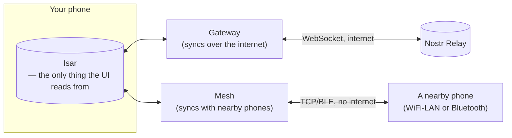
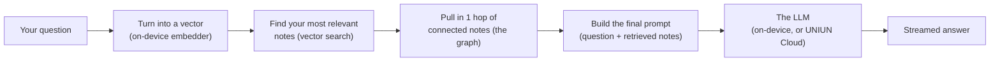
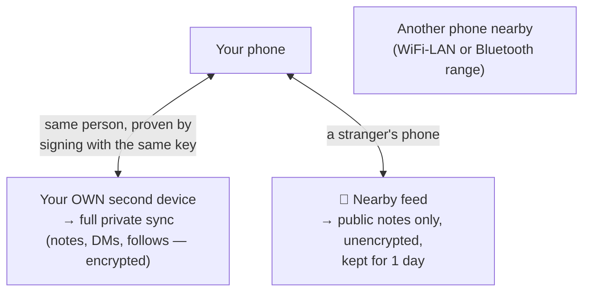
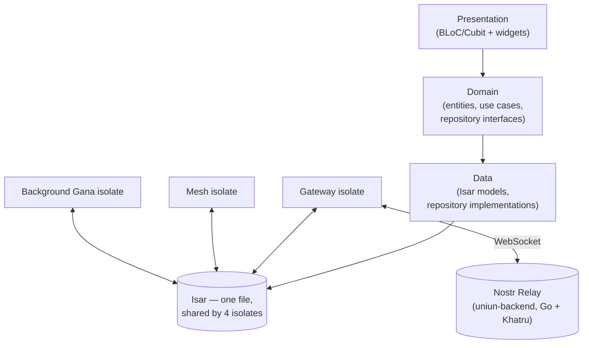

# UNIUN — What It Is, Simply

This is the plain-language tour of the app: what each part does and how they fit together, with diagrams. For terse technical rules and exact conventions (naming, file layout, do/don't lists), see `CLAUDE.md` instead — that file assumes you already know how the app works and just needs the rulebook. This one is for anyone learning what UNIUN actually *is*.

## The one-sentence version

UNIUN is a social + knowledge app where **everything you create is one thing — a Note** — built on the open Nostr protocol, that works fully offline, syncs over the internet when available, and can also sync with phones physically nearby with no internet or shared WiFi at all.

## Notes — the one unit everything is built from

There are no separate "posts," "comments," "messages," or "channel replies" as different data types. A feed post, a public-channel message, a direct message, and a private-channel message are all rows in the exact same database table (`Note`), told apart only by which Nostr **kind** number they carry:

| kind | What it is | How it's told apart |
|---|---|---|
| 1 | Feed post (Vishnu) | no channel/conversation/group set |
| 42 | Public channel message | `channelId` set |
| 14 / 15 | Direct message | `conversationId` set |
| 9023 | Private (encrypted) channel message | `groupId` set |

A note can carry text, an image (uploaded via Blossom, a content-addressed file store), mentions of other users, references to other notes, and hashtags. Those references *are* the knowledge graph — an "e" tag pointing at another note is a graph edge, a "t" tag is a graph node, with no separate graph-building step required; it falls out of the note data itself.

## Vishnu — the feed

A plain chronological feed (no ranking algorithm) of top-level notes from people you follow, plus your own. You can save a note (a private bookmark, used later by Shiv for context), follow a note's *reference graph* (get notified whenever someone else cites it — different from following a person), and reply into threads.

## Brahma — writing a note

The composer: write text, attach an image, tag someone, or reference an earlier note before publishing. Publishing signs the note with your own key and hands it to the Gateway's outgoing queue, which delivers it to the relay whenever the phone has a connection — you can write offline and it'll send the moment you're back online.

**Manas** is a side feature here: a named, user-curated subset of your notes (a personal knowledge base you build on purpose), used to scope what Shiv is allowed to read when you ask it a question.

## Shiv — the on-device AI assistant

Shiv answers questions grounded in your own notes, entirely on-device by default — no data leaves the phone unless you deliberately switch to a cloud model.

That five-step retrieve-then-generate loop is what "GraphRAG" means in this app — it's not a separate AI feature, it's just how every Shiv answer gets built.

**Two ways to run the model:**
- **On-device (default)** — a small model (Qwen3 0.6B, DeepSeek R1, Gemma 4 E2B, or Gemma 4 E4B) downloaded once and run locally via `flutter_gemma`. Nothing ever leaves the phone.
- **UNIUN Cloud (opt-in)** — sign in with your own Nostr key (no password, no separate account) to run against a larger hosted model through UNIUN's own inference gateway. You can also approve a **QR-login** to sign the same account into a browser, and switch which model — local or cloud — is active at any time from Settings.

**Things built on top of the same Shiv "brain":**
- **Gana** — a user-defined AI agent that watches something (a channel, a DM, a followed note) and autonomously publishes a reply/summary/response, on a schedule or reactively. Keeps running even while you've closed the app, via a background task.
- **Nataraj** — a swipe-deck feature that takes 2–3 of your own notes and synthesizes them into one new idea.
- **Composer-chat** — an inline "ask Shiv about this conversation" chat available from every composer (thread, channel, DM), not just the main Shiv tab.

## Groups and messaging

- **Public groups (NIP-28)** — open group chat anyone can join by QR code or group id. (These were called "Channels" in an earlier version of the app — the code, routes, and on-screen text all say "Group" today; full detail in `docs/Messaging/`.)
- **Private groups** — end-to-end encrypted group chat (using MLS, the same protocol family as Signal's group messaging), so the relay only ever sees ciphertext.
- **Direct messages (NIP-17)** — 1:1 encrypted messages, wrapped three layers deep so that even *who's talking to whom* is hidden from the relay, not just the message content.

## Mesh & Surrounding — syncing with nearby phones, no internet required

This is a completely separate sync path from the relay, used for two different things:

1. **Multi-device sync for yourself** — if you're logged into UNIUN on two of your own devices and they're near each other (same WiFi network, or Bluetooth range), they sync directly with each other, encrypted, with no relay and no internet involved at all.
2. **"📍 Nearby" (Surrounding)** — an entirely different, opt-in feature: if a stranger's UNIUN phone is close enough for your WiFi or Bluetooth radio to detect it, you exchange only *public* notes with each other, temporarily (1-day retention), in a separate feed tab. There's no GPS or map coordinates involved anywhere — "nearby" here means radio range, not location.

Being on the *same* WiFi network only matters for the WiFi half of this — it lets two phones find each other's IP address on the local network. It has nothing to do with your regular feed, which always goes through the internet relay regardless of physical distance. See `docs/Mesh/` for the full protocol detail.

## Sharing a note

Sharing embeds a full, self-contained snapshot of the original note (its exact signed content) directly inside the new note you're sharing it into — not a link or pointer. That means the shared copy still renders correctly even if the original note is later evicted from local storage (Isar retention doesn't apply to it), and its signature is verified once on arrival so a tampered snapshot shows as "unverified" instead of silently rendering.

## Reporting

Any foreign note or user can be reported for one of seven reasons (spam, impersonation, etc.). Reporting does three things at once: publishes a signed report event, hides that note locally so you stop seeing it, and optionally blocks the author if you check that box. UNIUN doesn't currently do anything with reports *other* people file — that's left to the relay operator.

## What UNIUN deliberately does not do

**There is no delete.** Once published, a note exists forever — no soft-delete field, no delete button, no NIP-09 (the Nostr deletion-event standard) support anywhere in the codebase. This is an intentional design principle ("feed freedom"), not a missing feature.

## Architecture, in one picture

Strictly one-directional: the UI never touches Isar directly, and never touches a relay or another phone directly either — only the Gateway (relays) and Mesh (nearby phones) isolates do that. See `docs/Architecture/CODEBASE_EXPLANATION.md` and `docs/Architecture/ISAR_DB.md` for the deeper version of this diagram.

## The Nostr protocols in use (NIPs)

| NIP | What it's for |
|---|---|
| NIP-01 | Base event format and relay protocol |
| NIP-02 | Contact list — drives who's in your feed |
| NIP-05 | `name@domain.com`-style human-readable identifiers |
| NIP-10 | Reply threading |
| NIP-17 | Direct messages (3-layer encrypted) |
| NIP-28 | Public channels |
| NIP-44 | The encryption underneath DMs and private channels |
| NIP-56 | Content reporting |
| NIP-77 | Efficient relay sync (negentropy) |
| NIP-92 | Inline image/media metadata |

**Permanently excluded:** NIP-09 (deletion) — see "What UNIUN deliberately does not do" above. Full detail on every NIP and exactly how UNIUN uses it: `docs/NOSTR/nips.md`.

## The on-device AI stack

| Piece | What it does |
|---|---|
| `flutter_gemma` | Runs the local LLM (Qwen3 0.6B / DeepSeek R1 / Gemma 4 E2B / Gemma 4 E4B) |
| `flutter_gemma_embeddings` | The on-device embedder that turns your notes into searchable vectors |
| ToStore | The on-device vector database those embeddings live in |
| UNIUN inference gateway (`api.uniun.in`) | The optional cloud backend — your own Nostr key is the login, no separate account/password |
| `openmls` | The encryption library behind private channels |

## Where to look next

- `CLAUDE.md` — the terse technical rulebook (exact naming, file conventions, what never to do).
- `docs/Architecture/CODEBASE_EXPLANATION.md` / `DATA_LAYER.md` / `DOMAIN_LAYER.md` / `PRESENTATION_LAYER.md` / `ISAR_DB.md` — the three-layer architecture, in depth.
- `docs/SHIVA/SHIV_AI.md`, `docs/SHIVA/Ganas.md`, `docs/SHIVA/scheduling.md` — the full Shiv/Gana/AI-scheduling design.
- `docs/Mesh/` — the full offline nearby-sync protocol (`README.md` overview, `MESH.md` and `SURROUNDING.md` for depth).
- `docs/Messaging/` — public groups, private groups, and DMs, in depth.
- `docs/General/QR_AND_DEEP_LINKS.md`, `docs/General/REPORTS.md` — the QR/deep-link system and content moderation.
- `docs/BRAHMA/Manas.md` — the Manas feature in depth.
